Basic SAS Forecasting Examples
=

Autoregressive Integrated Moving-Averages (ARIMA) models were popularised by Box and Jenkins. They forecast a time series variable using a linear combination of past time series values (i.e. 'auto' or 'self' regression). They combine an autoregressive model, first order differencing and a moving average model. The model order 'p, d, q', meaning 'AR Order, 1st Differencing Degree, MA Order', is denoted ARIMA(*p,d,q*) and combined as follows:

*X<sub>t</sub> = c + phi<sub>1</sub>X<sub>t-1</sub> + phi<sub>2</sub>X<sub>t-2</sub> +...+ phi<sub>p</sub>X<sub>t-p</sub> + e<sub>t</sub>*

*e<sub>t</sub> = theta<sub>1</sub>e<sub>t-1</sub> + theta<sub>2</sub>e<sub>t-2</sub> +...+ theta<sub>q</sub>e<sub>t-q</sub> + alpha<sub>t</sub>*

where *phi<sub>p</sub>* are autoregressive terms, *theta<sub>q</sub>* are moving average forecast terms for past forecast errors, and *alpha<sub>t</sub>* is a white noise sequence. An alternative notation uses the Backshift operator:

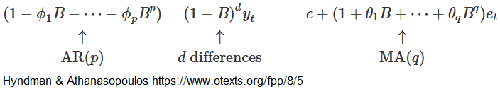

Components of the above formulas (e.g. AR, I, MA) are used selectively to create the leanest forecast model.

This page shows code and analysis for regression, Seasonal ARIMA, and autoregressive forecasts.

# Short-Term Departures

The presence of a time period variable such as "month" does not by itself suggest trend or seasonality. Such a variable facilitates a variety of statistical procedures useful in analysing time series and may have been included for that reason only. Although 'Short-Term Departures' (STD) is an economic variable, and is therefore likely to have trend and seasonality, the mere presence of a time period variables such as "month" does not guarantee it. Dummy variables do not guarantee trend either. However, they do suggest seasonality in the time series. This is because monthly dummy variables permit any stable year to year seasonal component within the series to be included in a regression model. Dummy variables allow the model to integrate the seasonal component via individual coefficients for each seasonal period (i.e. each month). This produces a better fitting model.


*Figure 1. Short Term Departures by Month*

Figure 1 above shows STD plotted across the monthly time period variable. There is an increasing trend across the plotted data with STD being much higher at the end of the series than at the beginning. There is also a seasonal component with peaks and troughs occurring in a stable and repeating pattern each year (i.e. period 12). This trend and seasonal pattern is expected with economic data such as air travel because of normal economic growth (e.g. expansion of the industry leading to increasing trend) and the seasonal nature of air travel (e.g. vacations, repeating periods of air travel around holidays, etc.).

```sas
LIBNAME TSWORK 'C:\BasicSAS';
OPTIONS NOCENTER PAGESIZE=150 LINESIZE=256;
DATA DATETRANS_ARRDEP;
	SET TSWORK.ARRDEP;
	DATE=INTNX('MONTH','1dec1975'd, _N_ );
	FORMAT DATE MMYYS.;
	SQRT_STD=SQRT(STD);
	LOG_STD=LOG(STD);
	LABEL SQRT_STD="Square Root of STD" LOG_STD="Log e of STD";
RUN;

ODS RTF FILE="MYFILE.rtf" STYLE=Styles.MYWAY1;
ODS GRAPHICS ON / RESET border=off HEIGHT=10CM;

GOPTIONS CSYMBOL=BLACK HSIZE=27cm FBY=TIMES FTEXT=TIMES FTITLE=TIMES;
AXIS1 LENGTH=100 OFFSET=(0) VALUE=(FONT=TIMES HEIGHT=2pct) LABEL=(FONT=TIMES HEIGHT=3pct);
AXIS2 OFFSET=(0) VALUE=(FONT=TIMES HEIGHT=2pct) LABEL=(FONT=TIMES ANGLE=90 HEIGHT=3pct);
SYMBOL VALUE=NONE COLOR=BLACK CI=BLACK INTERPOL=JOIN WIDTH=2;
PROC GPLOT DATA=DATETRANS_ARRDEP;
	FOOTNOTE FONT=ITALIC JUSTIFY=LEFT HEIGHT=3pct "Figure 1: Short Term Departures by Month";
	PLOT STD*DATE / HAXIS=AXIS1 VAXIS=AXIS2;
RUN; FOOTNOTE;
```

A transformation is necessary because the series does not have uniform variance across the series. The trend appears stable but the magnitude of annual seasonal variation becomes larger as month increases. This means that this time series has an additive trend component but a multiplicative seasonal component, or Pegels' classification B3. Note that it is possible that the trend component is also slightly multiplicative, meaning that Pegels' classification C3 could be argued, but this will most likely be corrected (i.e. made more linear) when the transformation stabilises the variance.


*Figure 2. Square Root, LOG(e) Transformation Comparison*

Figure 2 above shows the two transformation options. 'Log *e* of STD' is a natural log transform (W<sub>*t*</sub>=LOG*eY*<sub>*t*</sub>) and 'Square Root of STD' is a square root transform (W<sub>*t*</sub>=*Y*<sub>*t*</sub>). These change the scale of measurement to make the variance across the time series uniform.

The square root has not completely corrected the series. Variance still increases towards the end of the series and the trend remains slightly multiplicative. This will cause problems in later analysis if used. The logarithm is a stronger transformation and it has stabilised the variance across the series. In fact, the logarithm may have slightly over-transformed (i.e. 'over-corrected') because variance at the higher end of the series is now smaller than variance at the lower end. Despite this it is a better option than the square root, and a cube root would potentially provide a better transformation.

```sas
AXIS3 OFFSET=(0) ORDER=(8 TO 14) VALUE=(FONT=TIMES HEIGHT=2pct) LABEL=(FONT=TIMES ANGLE=90 HEIGHT=3pct);
AXIS4 OFFSET=(0) ORDER=(200 TO 1000 BY 100) VALUE=(FONT=TIMES HEIGHT=2pct) LABEL=(FONT=TIMES ANGLE=90 HEIGHT=3pct);
LEGEND1 MODE=SHARE POSITION=(TOP LEFT INSIDE) SHAPE=LINE(3)cm VALUE=(FONT=TIMES HEIGHT=3pct) LABEL=(FONT=TIMES HEIGHT=3pct POSITION=TOP 'Transformation') OFFSET=(4,-2);
LEGEND2 MODE=SHARE POSITION=(TOP LEFT INSIDE) SHAPE=LINE(3)cm VALUE=(FONT=TIMES HEIGHT=3pct) LABEL=(FONT=TIMES HEIGHT=3pct POSITION=TOP '') OFFSET=(4,-6.5);
SYMBOL1 VALUE=NONE CI=BLACK INTERPOL=JOIN WIDTH=2 LINE=1;
SYMBOL2 VALUE=NONE CI=BLACK INTERPOL=JOIN WIDTH=3 LINE=2;
PROC GPLOT DATA=DATETRANS_ARRDEP;
	FOOTNOTE FONT=ITALIC JUSTIFY=LEFT HEIGHT=3pct "Figure 2: Square Root, LOG(e) Transformation Comparison";
	PLOT LOG_STD*DATE / OVERLAY HAXIS=AXIS1 VAXIS=AXIS3 LEGEND=LEGEND1;
	PLOT2 SQRT_STD*DATE / OVERLAY VAXIS=AXIS4 LEGEND=LEGEND2;
RUN; FOOTNOTE;
```

A stepwise multiple regression produced an ANOVA table shown below as Table 1. STD was modelled by 'Month' and the dummy variables for each month. The original SAS code included a dummy variable for all months. Only 11 months would have been necessary, but the stepwise selection method dropped some months anyway, so there was no risk of the dummy variables combining to form perfect multicollinearity (i.e. dummy variable trap).

*Analysis of Variance*

|Source|DF|Sum of Squares|Mean Square|*F* Value|Pr > *F*|
|:--|--|--|--|--|--|
|Model|10|154.11077|15.41108|1347.11|<.0001|
|Error|416|4.75908|0.01144|||
|Corrected Total|426|158.86985||||

*Table 1. ANOVA table for STD x (month & dummy variables) model*

The model was created in 10 steps and includes a constant and 10 of the 13 variables. It was highly significant, R<sup>2</sup>=.97, *F*(10, 416)=1347.11, *p*<.0001, explaining 97% of the variation in STD with a linear function of the multiple time variables. This demonstrates that a well fitting and highly significant regression trend can be fitted to the transformed series. Seasonality can be demonstrated by reviewing individual coefficients within the model.

|Variable|Parameter Estimate|Standard Error|Type II SS|*F* Value|Pr > *F*|
|:--|--|--|--|--|--|
|Intercept|11.24049|0.01372|7680.18745|671339|<.0001|
|Month|0.00471|0.00004199|144.18267|12603.3|<.0001|
|jan|-0.20144|0.02061|1.09298|95.54|<.0001|
|feb|-0.35491|0.02061|3.39300|296.59|<.0001|
|mar|-0.06235|0.02061|0.10470|9.15|0.0026|
|apr|-0.05373|0.02061|0.07777|6.80|0.0095|
|jun|0.05799|0.02061|0.09058|7.92|0.0051|
|sep|0.04609|0.02083|0.05602|4.90|0.0275|
|oct|-0.15912|0.02083|0.66772|58.37|<.0001|
|nov|-0.18700|0.02083|0.92222|80.61|<.0001|
|dec|0.24614|0.02083|1.59786|139.67|<.0001|

*Table 2. Stepwise regression final model parameter estimates*

Table 2 shows the individual regression coefficients (i.e. parameter estimates) for the 'Month' variable and the significant dummy variables. The monthly dummy variables included are significant at least at the *p*<.05 level. The significance of the dummy variables as predictors confirms the presence of seasonality. 

The Durbin-Watson (DW) statistic was 1.264, which is low enough to reject the null hypothesis that the residuals (lag 1) are uncorrelated (T=427, K=11; DW<sub>U</sub>=1.889, DW<sub>L</sub>=1.794). This means that the residuals are not independent and that there is pattern within the model residuals (i.e. the unexplained variability of the regression). This is more apparent when reviewing a scatter plot of the residuals with a LOESS curve, shown below in Figure 3.

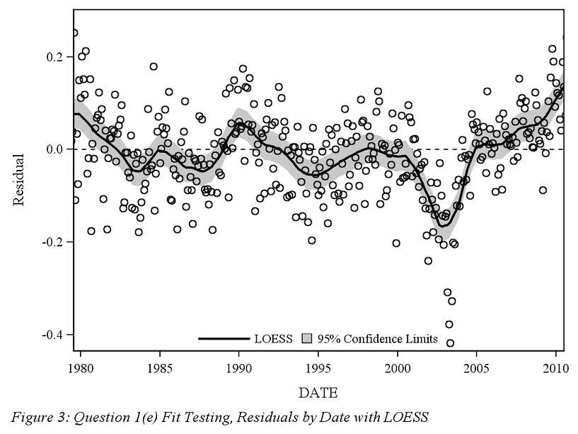

*Figure 3. Fit Testing, Residuals by Date with LOESS*

A LOESS curve shows the pattern leftover in the regression residuals. They are not independent, are not white noise, and contain information not captured by the model. Unknown variables are influencing STD and the standard errors of the coefficient estimates are underestimated or distorted. Forecasts will therefore be less reliable because the predictive power of these variables have not been captured and incorporated in the model.

The series is not stationary because the autocorrelations decline gradually. A first difference corrects this, meaning that d=1. The ACF now shows that the series has a strong seasonal component (period 12), meaning that D=1. The series is now stationary.

In terms of early peaks, the ACF has a significant peak at lag 1 while the PACF has significant peaks at lags 1 and 2. Based on this pattern the ACF row suggests q=1, while the PACF column suggests p=2.

In terms of late (seasonal) peaks, both the ACF and PACF have significant peaks at lag 12. This would mean that p=1 and Q=1 (s=12). There are smaller significant lags which do not make sense (ACF=3, 11; PACF=11, 13) and were ignored. This makes the starting model a SARIMA(1,1,1)(1,1,1)<sub>12</sub> (p=2 d=1 q=1, p=12 D=12 Q=12).

```sas
PROC REG DATA=DATETRANS_ARRDEP OUTEST=EST OUTVIF PLOTS(ONLY)=(fit DIAGNOSTICS(STATS=ALL) OBSERVEDBYPREDICTED RESIDUALBYPREDICTED RSTUDENTBYPREDICTED QQPLOT RESIDUALHISTOGRAM COOKSD);
	MODEL LOG_STD = month jan feb mar apr may jun jul aug sep oct nov dec / SELECTION=STEPWISE DW TOL VIF EDF AIC BIC CP SBC ;
	OUTPUT OUT=REGRESSION RESIDUAL=REG_RES PREDICTED=REG_PRED STDI=STDI LCL=REG_LCL UCL=REG_UCL;
RUN; QUIT; PROC PRINT DATA=EST; RUN;
PROC SGPLOT DATA=REGRESSION;
	FOOTNOTE JUSTIFY=LEFT ITALIC "Figure 3: Fit Testing, Residuals by Date with LOESS";
	REFLINE 0 / AXIS=y LINEATTRS=(COLOR=BLACK PATTERN=2);
	LOESS X=DATE Y=REG_RES / MARKERATTRS=(COLOR=BLACK) LINEATTRS=(COLOR=BLACK) ALPHA=.05 CLM LEGENDLABEL="LOESS" NAME="LINE1";
	KEYLEGEND "LINE1" / NOBORDER LOCATION=INSIDE POSITION=BOTTOM;
RUN; FOOTNOTE;
```

The first model had an AIC=-1074.39 and SBC=-1054.26 with only the two moving average components being significant. The autoregressive and moving average terms are only significant when used in isolated models. When combined, the moving average terms are sufficient and autoregressive terms lose significance. This new model is improved with a significant p=3 autoregressive term, referring to a quarterly pattern within the series identified in Figure 4 below.

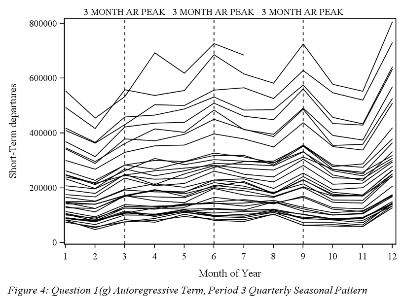

*Figure 4. Autoregressive Term, Period 3 Quarterly Seasonal Pattern*

Figure 4 shows the quarterly pattern for the p=3 autoregressive term. The final model was a SARIMA(1,1,1)(0,1,1)12 (p=3 d=1 q=1, p=0 D=12 Q=12), with an AIC=-1082.68 and SBC=-1070.6, with no constant and no significant residual autocorrelations. The model was forecast 66 months ahead for a plot below.

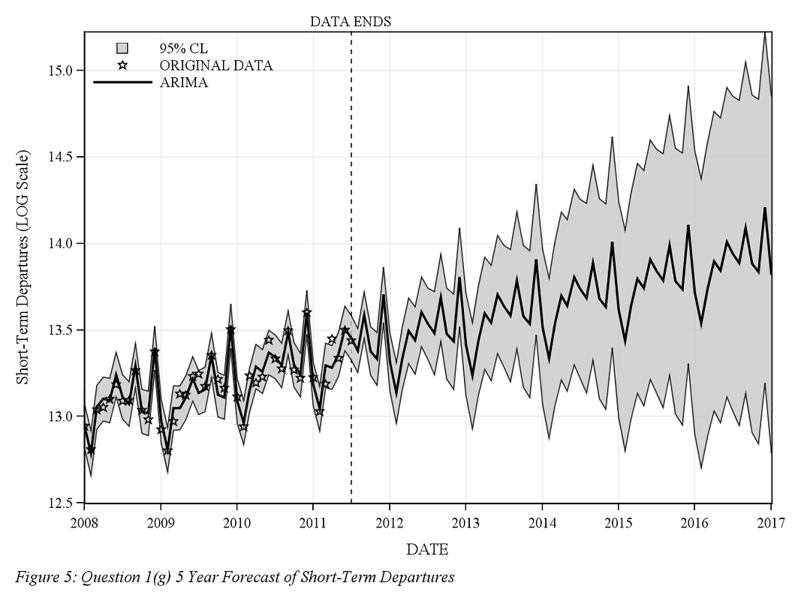

*Figure 5. Five Year Forecast of Short-Term Departures*

The Figure 5 forecast assumes that the residuals are normally distributed and uncorrelated. It also assumes that what occurred in the past will occur in the future. The underlying process generating the series must be stable or the behaviour of the time series will change while the forecasting model does not (i.e. forecasting with out of date data).

*Equation*

(1-*B*)(1-*B*<sup>12</sup>)(1-.11*B*<sup>3</sup>)logSTD<sub>*t*</sub>=(1-.66*B*)(1-.43*B*<sup>12</sup>)*e*<sub>*t*</sub>

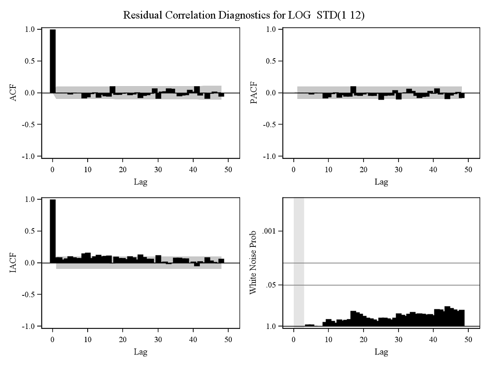

*Figure 6: Residual Correlation Diagnostics*

Figure 6 shows no significant autocorrelations, partial autocorrelations or white noise checks at any lag. This means that most of the predictive information within the series has successfully been incorporated into the SARIMA model, therefore optimising the capacity of that model to produce reliable forecasts. The remaining error is white noise.

```sas
DATA ARRDEP_ARIMA;
	SET TSWORK.ARRDEP;
	DATE=INTNX('MONTH','1dec1975'd, _N_ );
	FORMAT DATE MMYYS.;
	LOG_STD=LOG(STD);
	YEAR=YEAR(DATE);
	RENAME STD=STD1;
	LABEL LOG_STD="Log e of STD" STD1="Short-Term departures";
	DROP F7 LTA LTD PA PD STA apr aug dec feb jan jul jun mar may nov oct sep;
RUN;
PROC ARIMA DATA=ARRDEP_ARIMA PLOTS(ONLY)=(SERIES(CORR) RESIDUAL(CORR NORMAL SMOOTH) FORECAST(ALL));
	IDENTIFY VAR=LOG_STD(1,12) NLAG=48 CLEAR;
	ESTIMATE p=(3) Q=(1)(12) NOCONSTANT;
	FORECAST ID=DATE INTERVAL=MONTH PRINTALL LEAD=66 OUT=ARIMA;
RUN; QUIT;
PROC SGPLOT DATA=ARRDEP_ARIMA NOAUTOLEGEND;
	FOOTNOTE ITALIC JUSTIFY=LEFT "Figure 4: Autoregressive Term, Period 3 Quarterly Seasonal Pattern";
	REFLINE 3 6 9 / AXIS=X LABEL=("3 MONTH AR PEAK" "3 MONTH AR PEAK" "3 MONTH AR PEAK") LINEATTRS=(COLOR=BLACK PATTERN=2) LABELLOC=OUTSIDE;
	SERIES X=MOY Y=STD1 / GROUp=YEAR LINEATTRS=(PATTERN=1);
	XAXIS VALUES=(1 TO 12 BY 1);
RUN; FOOTNOTE;
PROC SGPLOT DATA=ARIMA;
	FOOTNOTE ITALIC JUSTIFY=LEFT "Figure 5: Five Year Forecast of Short-Term Departures";
	REFLINE "01JUL2011"d / AXIS=X LABEL=("DATA ENDS") LINEATTRS=(COLOR=BLACK PATTERN=2) LABELLOC=OUTSIDE;
	BAND UPPER=U95 LOWER=L95 X=DATE / FILL OUTLINE TRANSPARENCY=.2 LEGENDLABEL="95% CL";
	SCATTER X=DATE Y=LOG_STD / LEGENDLABEL="ORIGINAL DATA" MARKERATTRS=(SYMBOL=STAR);
	SERIES X=DATE Y=FORECAST / LEGENDLABEL="ARIMA" LINEATTRS=(COLOR=BLACK thickness=2);
	XAXIS GRID OFFSETMIN=0 OFFSETMAX=0 MIN='1JUL2008'd MAX='1JUL2016'd;
	YAXIS GRID OFFSETMIN=0 OFFSETMAX=0 min=12.5 LABEL="Short-Term Departures (LOG Scale)";
	KEYLEGEND / DOWN=3 NOBORDER LOCATION=INSIDE POSITION=TOPLEFT;
RUN; FOOTNOTE;
PROC REG DATA=ARIMA;
	MODEL RESIDUAL= /DW;
RUN;
```

The regression Root MSE was 0.107 and SARIMA SSE was 0.065. This means the SARIMA had less error and is a better model by that criterion. Some measures of fit can be distorted when comparing regression with ARIMA. In this case, the regression fit statistics (e.g. SBC, AIC) are much better than the SARIMA's. However, the autocorrelation within the regression residuals shows that they are not independent, meaning that those fit statistics and model forecasts are unreliable. Meanwhile, the SARIMA residuals are independent, with that model incorporating all available information/pattern from the series into forecasts and leaving only white noise in the residuals. This makes the SARIMA a more reliable model.

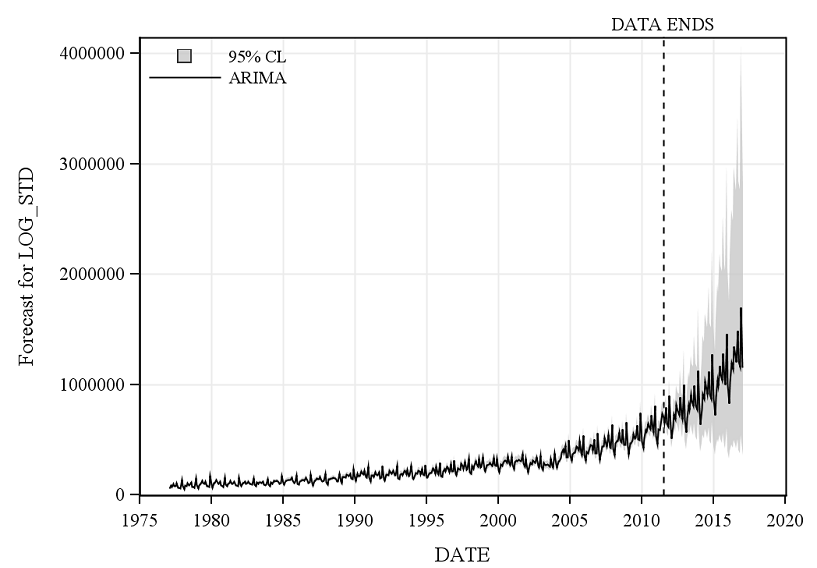

*Figure 7. Final Forecast*

It is difficult to see the 2008 Global Financial Crisis in this plot. However, there is a very clear trough between 2002 and 2003. An explanation for this could be the combined effect of the Bali Bombing (12 OCT 2002) and the outbreak of Severe Acute Respiratory Syndrome (NOV 2002 to JUL 2003). The plot was unclear when displayed with the original data. The date range of the plot must be restricted before it is clear to show the original data, as in Figure 8 below.

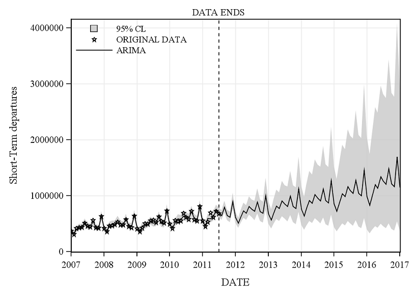

*Figure 8. Final Forecast, Date Restricted*

```sas
DATA FINALFORE;
	MERGE ARRDEP_ARIMA ARIMA;
	BY DATE;
	LABEL REG_PRED="ARIMA Forecast";
	FORECAST=EXP(FORECAST+STD*STD/2);
	L95=EXP(L95);
	U95=EXP(U95);
	DROP YEAR STD RESIDUAL MOY LOG_STD;
RUN;
PROC SGPLOT DATA=FINALFORE;
	FOOTNOTE ITALIC JUSTIFY=LEFT "Figure 7: Final Forecasts";
	REFLINE "01JUL2011"d / AXIS=X LABEL=("DATA ENDS") LINEATTRS=(COLOR=BLACK PATTERN=2) LABELLOC=OUTSIDE;
	BAND UPPER=U95 LOWER=L95 X=DATE / FILL TRANSPARENCY=.2 LEGENDLABEL="95% CL";
	SERIES X=DATE Y=FORECAST / LEGENDLABEL="ARIMA" LINEATTRS=(COLOR=BLACK thickness=.1PCT);
	XAXIS GRID OFFSETMIN=0 OFFSETMAX=0;
	YAXIS GRID OFFSETMIN=0 ;
	KEYLEGEND / DOWN=3 NOBORDER LOCATION=INSIDE POSITION=TOPLEFT;
RUN; FOOTNOTE;
PROC SGPLOT DATA=FINALFORE;
	FOOTNOTE ITALIC JUSTIFY=LEFT "Figure 8: Final Forecasts, Date Restricted";
	REFLINE "01JUL2011"d / AXIS=X LABEL=("DATA ENDS") LINEATTRS=(COLOR=BLACK PATTERN=2) LABELLOC=OUTSIDE;
	BAND UPPER=U95 LOWER=L95 X=DATE / FILL TRANSPARENCY=.2 LEGENDLABEL="95% CL";
	SCATTER X=DATE Y=STD1 / LEGENDLABEL="ORIGINAL DATA" MARKERATTRS=(SYMBOL=STAR SIZE=5);
	SERIES X=DATE Y=FORECAST / LEGENDLABEL="ARIMA" LINEATTRS=(COLOR=BLACK thickness=.1PCT);
	XAXIS GRID OFFSETMIN=0 OFFSETMAX=0 MIN='1JUL2007'd MAX='1JUL2016'd;
	YAXIS GRID OFFSETMIN=0 ;
	KEYLEGEND / DOWN=3 NOBORDER LOCATION=INSIDE POSITION=TOPLEFT;
RUN; FOOTNOTE;
ODS RTF CLOSE; ODS GRAPHICS OFF;
```

# Household Spending Regression

The time series in this example is total monthly sales ($millions, current price terms) of 'household goods' in all Australian States. These data come from the Retail Business Survey collected by the Australian Bureau of statistics. It is a monthly time series starting in April 1982 and ending in September 2011 (N=354). It was chosen for the strong seasonality within the series.

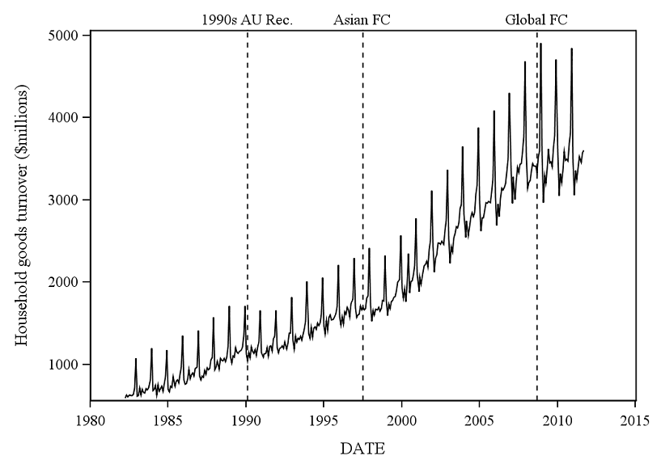

*Figure 9. Series Plot*

Figure 9 shows the time series to be forecast. It has a strong seasonal component; Every year it peaks in December, drops back down in January, and is lowest in February. There is an increasing trend for most of the series that flattens out with each crisis. The variance is not stable and has grown by several orders of magnitude since 1982. To forecast it, a multiple regression will be tested first due to the trend component and need for long-term forecasts. This will be followed by a SARIMA model due to the seasonal component and need for short-term forecasts. Finally, both models will be compared to an autoregressive model (i.e. regression with ARIMA errors).

```sas
LIBNAME TSWORK 'C:\BasicSAS';
OPTIONS NOCENTER PAGESIZE=150 LINESIZE=256;
DATA HOUSEHOLD; SET TSWORK.HOUSEHOLD;
	DATE=INTNX('MONTH','1MAR1982'd, _N_ );
	FORMAT DATE MMYYS.;
	HG_RETAIL_LOG=LOG(HG_RETAIL);
	HG_RETAIL_SQRT=SQRT(HG_RETAIL);
	LABEL HG_RETAIL='Household goods turnover ($millions)'
			HG_RETAIL_LOG='Household goods turnover (LOG)'
			HG_RETAIL_SQRT='Household goods turnover (SQRT)';
RUN;

ODS GRAPHICS ON / RESET border=off HEIGHT=10CM;
ODS RTF FILE="MYFILE.rtf" STYLE=Styles.MYWAY1;
*Series plot and transform;
PROC SGPLOT DATA=HOUSEHOLD NOAUTOLEGEND;
	FOOTNOTE JUSTIFY=LEFT ITALIC "Figure 9: Series Plot"; 
	REFLINE "01sep2008"d / AXIS=X LABEL=("Global FC") LINEATTRS=(COLOR=BLACK PATTERN=2);
	REFLINE "01jul1997"d / AXIS=X LABEL=("Asian FC") LINEATTRS=(COLOR=BLACK PATTERN=2);
	REFLINE "01FEB1990"d / AXIS=X LABEL=("1990s AU Rec.") LINEATTRS=(COLOR=BLACK PATTERN=2) ;
	SERIES X=DATE Y=HG_RETAIL / LEGENDLABEL="Household Goods Retailing";
	XAXIS OFFSETMIN=0 OFFSETMAX=0;
RUN; FOOTNOTE;
```

The ABS considers their series to be "a highly reliable Australian total turnover estimate". Forecasts will be useful for determining stock needs for different retailers (e.g. furniture, electrical, hardware). The seasonal pattern shows stable sales for most of each year, followed by a volatile December peak and January/February trough. This turnover pattern makes it crucial for retailers to have accurate sales predictions. If they have too little stock they will miss the biggest month of the year. If they have too much they will be left selling surplus stock in the worst month of the year. This pattern exposes retailers to uncertainty and financial risk that should instead be managed through reliable turnover forecasts.

The series was transformed to stabilise the variance. Figure 10 compares square root and natural logarithm transformations.

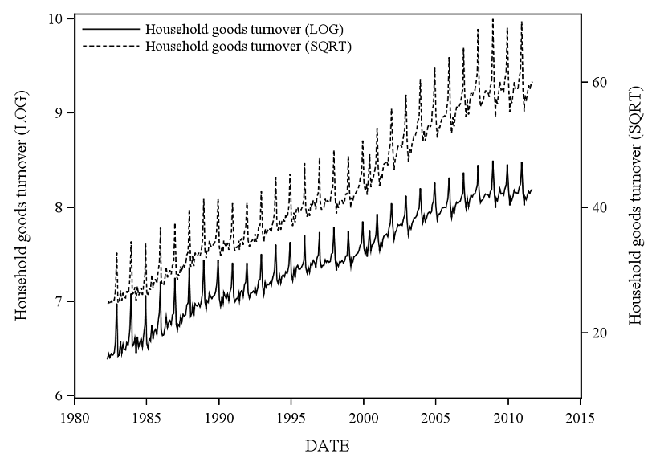

*Figure 10. Transformation Comparison*

No trading day variables were included because 'Monday to Friday' is not an accurate representation of trading days in Australia's deregulated retail sector. Also, the seasonality of this series, with high December sales relating to Christmas, makes an accurate and meaningful trading day variable difficult to formulate. A 'total days per month' variable, lagged variables, and some squared and cubic terms were tested in preliminary regressions but caused multicollinearity with monthly dummy variables or had coefficients of zero. The only variables that were safe to include in the model were 11 monthly dummy variables.

Two highly significant outliers were identified, June 2000 and March 1986, in a later ARIMA procedure. These outliers distorted fit statistics and measures of autocorrelation and were replaced with the average of the value one year ahead and one behind of the same month. This made the dataset more stationary, less distorted, and improved model fit.

```sas
PROC SGPLOT DATA=HOUSEHOLD;
	FOOTNOTE JUSTIFY=LEFT ITALIC "Figure 10: Transformation Comparison"; 
	SERIES X=DATE Y=HG_RETAIL_LOG / LINEATTRS=(COLOR=BLACK PATTERN=1);
	SERIES X=DATE Y=HG_RETAIL_SQRT / Y2AXIS LINEATTRS=(COLOR=BLACK PATTERN=3);
	YAXIS MINOFFSET=0 MIN=6 MAX=10;
	Y2AXIS MINOFFSET=0 MIN=10;
	XAXIS OFFSETMIN=0 OFFSETMAX=0;
	KEYLEGEND / NOBORDER DOWN=4 LOCATION=INSIDE POSITION=TOPLEFT;
RUN; FOOTNOTE;
```

An automatic stepwise selection process was used to provide a model determined exclusively by the statistical characteristics of fit. Other selection process and a variety of models were experimented with but an identical model was produced. The results of the stepwise selection model are presented below.

*Analysis of Variance*

|Source|DF|Sum of Squares|Mean Square|*F* Value|Pr > *F*|
|:--|--|--|--|--|--|
|Model|12|99.49009|8.29084|2022.98|<.0001|
|Error|341|1.39753|0.00410|||
|Corrected Total|353|100.88762||||

*Table 3. ANOVA table for sales x (month & dummy variables)*

According to Table 3 the model is highly significant. It has an R<sup>2</sup> of 0.9861, meaning that the regression explains 99% of the variation in household goods sales during the 353 month period. Below is a summary of the parameter estimates.

*Parameter Estimates*

|Variable|Label|DF|Parameter Estimate|Standard Error|*t* Value|Pr > \|*t*\||Tolerance|Variance Inflation|
|:--|--|--|--|--|--|--|--|--|
|Intercept|Intercept|1|6.87345|0.01327|518.01|<.0001|.|0|
|MONTH||1|0.00508|0.00003330|152.51|<.0001|0.99972|1.00028|
|JAN||1|-0.36471|0.01681|-21.69|<.0001|0.54461|1.83617|
|FEB||1|-0.45076|0.01681|-26.81|<.0001|0.54461|1.83619|
|MAR||1|-0.37793|0.01681|-22.48|<.0001|0.54460|1.83622|
|APR||1|-0.42728|0.01667|-25.63|<.0001|0.53703|1.86210|
|MAY||1|-0.35518|0.01667|-21.30|<.0001|0.53703|1.86208|
|JUN||1|-0.37113|0.01667|-22.26|<.0001|0.53704|1.86207|
|JUL||1|-0.36497|0.01667|-21.89|<.0001|0.53703|1.86208|
|AUG||1|-0.36046|0.01667|-21.62|<.0001|0.53703|1.86210|
|SEP||1|-0.37364|0.01667|-22.41|<.0001|0.53702|1.86214|
|OCT||1|-0.30824|0.01681|-18.33|<.0001|0.54461|1.83619|
|NOV||1|-0.26321|0.01681|-15.66|<.0001|0.54461|1.83617|

*Table 4. Summary Table of parameter estimates, significance and multicollinearity*

Table 4 shows the parameters and VIF for the regression model. For this model, Root MSE=0.064, AIC= -1933.25 and SBC=-1882.94 and Cp=13. For a 13 variable model these fit statistics are excellent. However, the DW was 0.587 (T=354, K=13; DW<sub>U</sub>=1.896, DW<sub>L</sub>=1.754) meaning that the residuals were not independent.

```sas
DATA REG_INPUT;
	SET ARIMA;
	MONTH=_N_;
	MONTH_NUMBER=MONTH(DATE);
	IF MONTH_NUMBER = 1 THEN JAN=1; ELSE JAN=0;
	IF MONTH_NUMBER = 2 THEN FEB=1; ELSE FEB=0;
	IF MONTH_NUMBER = 3 THEN MAR=1; ELSE MAR=0;
	IF MONTH_NUMBER = 4 THEN APR=1; ELSE APR=0;
	IF MONTH_NUMBER = 5 THEN MAY=1; ELSE MAY=0;
	IF MONTH_NUMBER = 6 THEN JUN=1; ELSE JUN=0;
	IF MONTH_NUMBER = 7 THEN JUL=1; ELSE JUL=0;
	IF MONTH_NUMBER = 8 THEN AUG=1; ELSE AUG=0;
	IF MONTH_NUMBER = 9 THEN SEp=1; ELSE SEp=0;
	IF MONTH_NUMBER = 10 THEN OCT=1; ELSE OCT=0;
	IF MONTH_NUMBER = 11 THEN NOV=1; ELSE NOV=0;
	LABEL SQUARE='Squared Month';
RUN;
PROC REG DATA=REG_INPUT OUTEST=EST OUTVIF PLOTS(ONLY)=(fit DIAGNOSTICS(STATS=ALL) OBSERVEDBYPREDICTED RESIDUALBYPREDICTED RSTUDENTBYPREDICTED QQPLOT RESIDUALHISTOGRAM COOKSD);
	MODEL HG_RETAIL_LOG = month jan feb mar apr may jun jul aug sep oct nov / SELECTION=STEPWISE DW TOL VIF EDF AIC BIC CP SBC ;
	OUTPUT OUT=REGRESSION RESIDUAL=REG_RES PREDICTED=REG_PRED STDI=STDI LCL=REG_LCL UCL=REG_UCL;
RUN; QUIT; PROC PRINT DATA=EST; RUN;
```

This is more visible in the residuals, plotted in Figure 11 below.

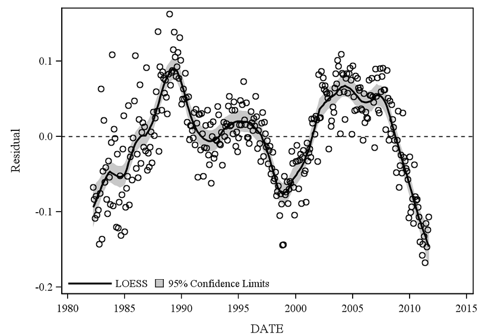

*Figure 11. Fit Testing, Residuals by Date with LOESS*

A LOESS curve shows the pattern leftover in the regression residuals. They are not independent, are not white noise, and contain information not captured by the model. This explains the low DW statistic and means that fit statistics (e.g. R<sup>2</sup>) and forecasts are unreliable. The residual histogram and QQ plot show that the residuals are otherwise normally distributed with some influential points but no outliers.

```sas
DATA FORECAST2;
	SET REGRESSION;
	FORECAST=EXP(FORECAST+STD*STD/2);
	L95=EXP(L95);
	U95=EXP(U95);
	REG_PRED=EXP(REG_PRED+STDI*STDI/2);
	REG_LCL=EXP(REG_LCL);
	REG_UCL=EXP(REG_UCL);
RUN;
PROC SGPLOT DATA=REGRESSION;
	FOOTNOTE ITALIC JUSTIFY=LEFT "Figure 11: Fit Testing, Residuals by Date with LOESS";
	WHERE DATE<='1JUL2012'd;
	REFLINE 0 / AXIS=y LINEATTRS=(COLOR=BLACK PATTERN=2);
	LOESS X=DATE Y=REG_RES / MARKERATTRS=(COLOR=BLACK) LINEATTRS=(COLOR=BLACK) ALPHA=.05 CLM LEGENDLABEL="LOESS" NAME="LINE1";
	KEYLEGEND "LINE1" / NOBORDER LOCATION=INSIDE POSITION=BOTTOMLEFT;
RUN; FOOTNOTE;
```

Below is a plot of a five year forecast produced by this model.


*Figure 12. Five Year Forecast, Date Restricted*

Figure 12 shows how useful regression is for long-term forecasts and how a model with monthly dummy variables can track seasonal patterns.

```sas
DATA FORECAST2;
	MERGE HOUSEHOLD FORECAST2;
	RUN;
PROC SGPLOT DATA=FORECAST2;
	FOOTNOTE ITALIC JUSTIFY=LEFT "Figure 12: Five Year Forecast, Date Restricted";
	BAND UPPER=REG_UCL LOWER=REG_LCL X=DATE / outline FILL TRANSPARENCY=.2 LEGENDLABEL="95% CL";
	REFLINE "01oct2011"d / AXIS=X LABEL=("DATA ENDS") LINEATTRS=(COLOR=BLACK PATTERN=2) LABELLOC=OUTSIDE;
	SCATTER X=DATE Y=HG_RETAIL / LEGENDLABEL="ORIGINAL DATA" MARKERATTRS=(SYMBOL=STAR);
	SERIES X=DATE Y=REG_PRED / LEGENDLABEL="REGRESSION";
	XAXIS GRID OFFSETMIN=0 OFFSETMAX=0  MIN='1JUL2008'd MAX='1JUL2016'd;
	YAXIS GRID OFFSETMIN=0 MIN=2000;
	KEYLEGEND / NOBORDER DOWN=4 LOCATION=INSIDE POSITION=TOPLEFT;
RUN; FOOTNOTE;
```

Unfortunately, with the autocorrelated residuals, the forecasts from this model are unreliable. This can be demonstrated be closer examination of the full series prediction.

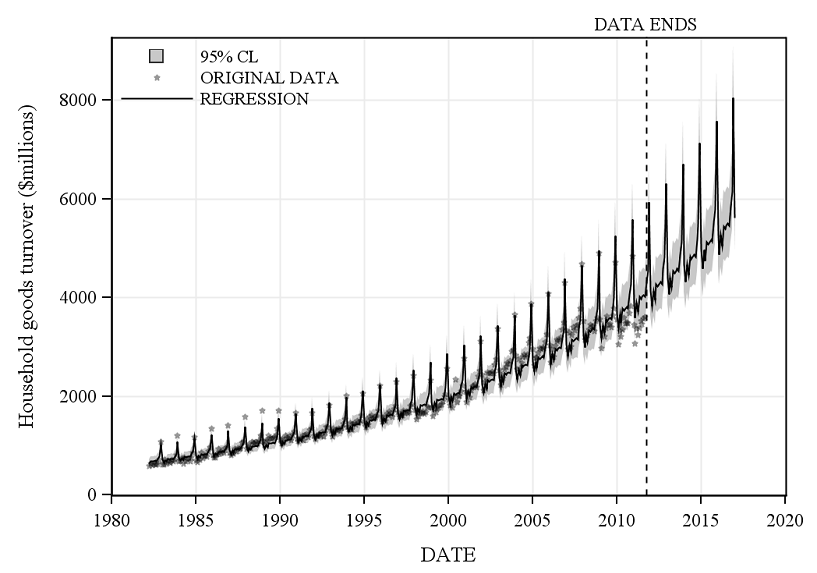

*Figure 13. Full Series with Regression Forecast*

Figure 13 shows how the regression smooths the time series into a uniform curve and fails to capture how the original data responded to each economic downturn. In particular, while the real series flattens out in response to the GFC, the regression moves right over the dip seemingly without change.

```sas
PROC SGPLOT DATA=FORECAST2;
	FOOTNOTE ITALIC JUSTIFY=LEFT "Figure 13: Full Series with Regression Forecast";
	BAND UPPER=REG_UCL LOWER=REG_LCL X=DATE / FILL LEGENDLABEL="95% CL";
	REFLINE "01oct2011"d / AXIS=X LABEL=("DATA ENDS") LINEATTRS=(COLOR=BLACK PATTERN=2) LABELLOC=OUTSIDE;
	SCATTER X=DATE Y=HG_RETAIL / LEGENDLABEL="ORIGINAL DATA" TRANSPARENCY=.6 MARKERATTRS=(SYMBOL=STAR SIZE=.8PCT);
	SERIES X=DATE Y=REG_PRED / LEGENDLABEL="REGRESSION";
	XAXIS GRID OFFSETMIN=0 OFFSETMAX=0;
	YAXIS GRID OFFSETMIN=0;
	KEYLEGEND / NOBORDER DOWN=4 LOCATION=INSIDE POSITION=TOPLEFT;
RUN; FOOTNOTE;
```

*Regression Equation*

Household goods sales<sub>*t*</sub>=6.87+.005(Month)-0.36(Jan)-0.45(Feb)-0.38(Mar)-0.43(Apr)-0.36(May)-0.37(Jun)-0.36(Jul)-0.36(Aug)-0.37(Sep)-0.31(Oct)-0.26(Nov)+*e*<sub>*t*</sub>

#### Conclusion
The regression model has excellent fit statistics, but the residuals are not independent, meaning that those statistics are unreliable. There is information within the residuals that the regression has failed to incorporate. For that reason, the regression may not provide accurate forecasts at all. A SARIMA model is indicated if there is need for more accurate short-term forecasts.

# Household Spending SARIMA

A SARIMA model was attempted to determine whether an autoregressive, integrated, moving average model can produce reliable predictions. The logarithm series was given a first and seasonal difference and became stationary. Below is a diagnostic table of the peaks after differencing.
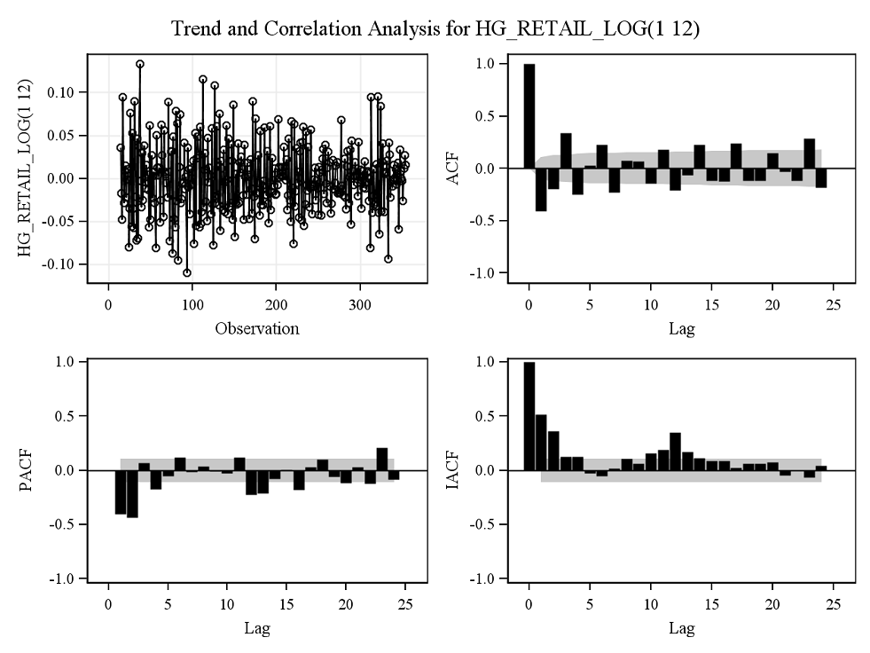

*Figure 14. Identification graphs for SARIMA modelling*

From the identification graphs in Figure 6, SARIMA(1,1,1)(1,1,1)<sub>12</sub> was used as a starting model because there were two peaks on both the ACF and PACF. A variety of terms were tried to improve the model. A factored subset model provided the best fit for the autoregressive terms rather than a single factor model. The first autoregressive factor was p=1 and the second was p=(3,6). Parameter assumptions were met for this higher order autoregressive factor. The significance of these lags is explained as a quarterly and half-yearly purchasing pattern. For the moving average factors, a traditional factored model between the seasonal and non-seasonal terms was used, q=(1)(12). All terms were significant and the non-significant constant was removed. The final model was SARIMA(3,1,1)(0,1,1)<sub>12</sub> with two of the three non-seasonal autoregressive terms factored against the other.

*Conditional Least Squares Estimation*

|Parameter|Estimate|Standard Error|*t* Value|Approx Pr > \|*t*\||Lag|
|:--|--|--|--|--|--|
|MA1,1|0.83816|0.04835|17.34|<.0001|1|
|MA2,1|0.49804|0.04832|10.31|<.0001|12|
|AR1,1|0.24512|0.07552|3.25|0.0013|1|
|AR2,1|0.32330|0.06245|5.18|<.0001|3|
|AR2,2|0.15874|0.05518|2.88|0.0043|6|

*Table 5. SARIMA Autoregressive and Moving Average terms*

According to Table 5 all the AR and MA terms were significant to *p*<.05. They reduced the number of significant ACF and PACF peaks to less than 5%. For this model SSE=0.029, AIC= -1430.9 and SBC-1411.74, which are the best statistics producible with only explainable lag terms.
One problem with this model is that some of the white noise autocorrelation checks were still significant. However, the model had less pattern in the residuals than the regression as shown by the DW of 1.994 (T=354, K=13; DW<sub>U</sub>=1.754, DW<sub>L</sub>=1.896) (i.e. residuals were independent). This lack of pattern is clear in the residuals plotted in Figure 15 below.

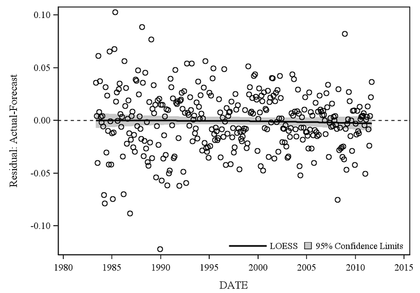

*Figure 15. Fit Testing, Residuals by Date with LOESS*

The LOESS curve in Figure 15 supports the conclusion that the residuals for the SARIMA are independent. There is some minor heteroscedasticity, indicated by residuals expanding at earlier dates, but the histogram and QQ plots show normal distributions. A five year forecast is plotted below

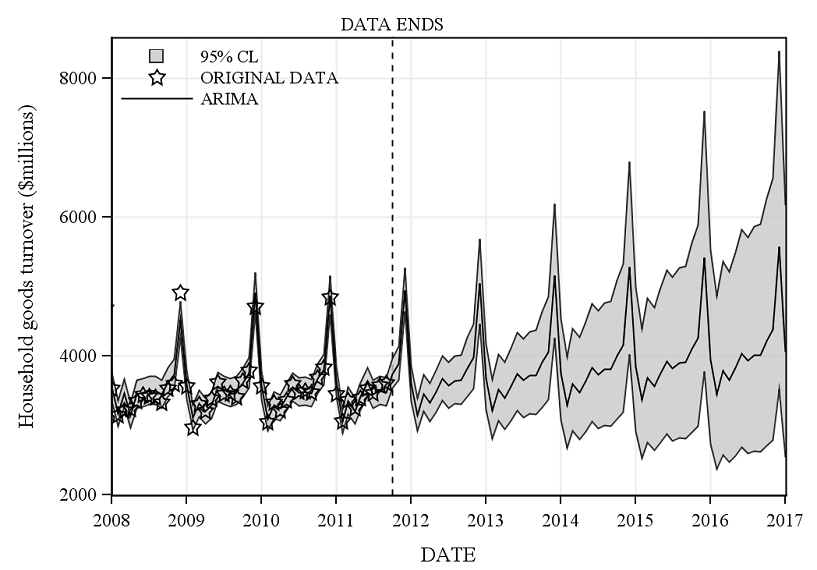

*Figure 16. ARIMA Forecast, Date Restricted*

Figure 16 shows how well suited SARIMA is for short-term forecasts. The model replicates the seasonality and predicts with narrow confidence intervals for the first year. After that however, confidence limits expand dramatically, ruling ARIMA out for long-term forecasting. Below is a scatter plot of the full time series and SARIMA predicted series.

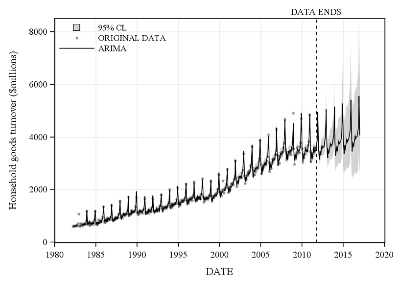

*Figure 17. Full Series with ARIMA Forecast*

Compared to the regression the predicted SARIMA series is sensitive to the fluctuations in the original series values. The SARIMA may have worse fit statistics (e.g. SBC, AIC) than the regression, but has almost no residual autocorrelation. This means that those measures of fit are more representative of the actual model and the short-term forecasts will be more reliable.

*SARIMA Equation*

(1-*B*)(1-B<sup>12</sup>)(1-.25*B*)(1-.32*B*<sup>3</sup>-.16*B*<sup>6</sup>)

Household goods sales<sub>t</sub> =(1-.84*B*)(1-.5*B*<sup>12</sup>)*e*<sub>t</sub>

#### Conclusion

The SARIMA model will provide reliable short-term forecasts. The confidence intervals expand quickly and make it unreliable for long-term forecasts. An autoregressive model that corrects the flaws in the regression is suggested for long-term forecasts.

```sas
DATA HOUSEHOLD; SET TSWORK.HOUSEHOLD;
	DATE=INTNX('MONTH','1MAR1982'd, _N_ );
	FORMAT DATE MMYYS.;
	HG_RETAIL_LOG=LOG(HG_RETAIL);
	IF _N_=219 THEN HG_RETAIL_LOG=mean(7.6985281383,7.4838066877);
	IF _N_=48 THEN HG_RETAIL_LOG=mean(6.6096187486,6.759603238);
	LABEL HG_RETAIL='Household goods turnover ($millions)'
			HG_RETAIL_LOG='Household goods turnover (LOG)';
RUN;
PROC ARIMA DATA=HOUSEHOLD PLOTS=ALL;
	IDENTIFY VAR=HG_RETAIL_LOG(1,12) NLAG=24 CLEAR;
	ESTIMATE p=(1)(3,6) Q=(1)(12) NOCONSTANT;
	OUTLIER;
	FORECAST ID=DATE INTERVAL=MONTH PRINTALL LEAD=64 OUT=ARIMA;
PROC SGPLOT DATA=ARIMA;
	FOOTNOTE ITALIC JUSTIFY=LEFT "Figure 15: Fit Testing, Residuals by Date with LOESS";
	WHERE DATE<='1JUL2012'd;
	REFLINE 0 / AXIS=y LINEATTRS=(COLOR=BLACK PATTERN=2);
	LOESS X=DATE Y=RESIDUAL / MARKERATTRS=(COLOR=BLACK) LINEATTRS=(COLOR=BLACK) ALPHA=.05 CLM LEGENDLABEL="LOESS" NAME="LINE1";
	KEYLEGEND "LINE1" / NOBORDER LOCATION=INSIDE POSITION=BOTTOMRIGHT;
RUN; FOOTNOTE;
DATA FORECAST1;
	SET ARIMA;
	FORECAST=EXP(FORECAST+STD*STD/2);
	L95=EXP(L95);
	U95=EXP(U95);
RUN;
DATA FORECAST1;
	MERGE HOUSEHOLD FORECAST1;
	RUN;
PROC SGPLOT DATA=FORECAST1;
	FOOTNOTE ITALIC JUSTIFY=LEFT "Figure 16: ARIMA Forecast, Date Restricted";
	REFLINE "01oct2011"d / AXIS=X LABEL=("DATA ENDS") LINEATTRS=(COLOR=BLACK PATTERN=2) LABELLOC=OUTSIDE;
	BAND UPPER=U95 LOWER=L95 X=DATE / outline FILL TRANSPARENCY=.2 LEGENDLABEL="95% CL";
	SCATTER X=DATE Y=HG_RETAIL / LEGENDLABEL="ORIGINAL DATA" MARKERATTRS=(SYMBOL=star SIZE=2pct);
	SERIES X=DATE Y=FORECAST / LEGENDLABEL="ARIMA";
	XAXIS GRID OFFSETMIN=0 OFFSETMAX=0 MIN='1JUL2008'd MAX='1JUL2016'd;
	YAXIS GRID OFFSETMIN=0 MIN=2000;
	KEYLEGEND / NOBORDER DOWN=4 LOCATION=INSIDE POSITION=TOPLEFT;
RUN; FOOTNOTE;
PROC SGPLOT DATA=FORECAST1;
	FOOTNOTE ITALIC JUSTIFY=LEFT "Figure 17: Full Series with ARIMA Forecast";
	REFLINE "01oct2011"d / AXIS=X LABEL=("DATA ENDS") LINEATTRS=(COLOR=BLACK PATTERN=2) LABELLOC=OUTSIDE;
	BAND UPPER=U95 LOWER=L95 X=DATE / FILL TRANSPARENCY=.2 LEGENDLABEL="95% CL";
	SCATTER X=DATE Y=HG_RETAIL / LEGENDLABEL="ORIGINAL DATA" TRANSPARENCY=.6 MARKERATTRS=(SYMBOL=STAR SIZE=.8PCT);
	SERIES X=DATE Y=FORECAST / LEGENDLABEL="ARIMA";
	XAXIS GRID OFFSETMIN=0 OFFSETMAX=0 ;
	YAXIS GRID OFFSETMIN=0;
	KEYLEGEND / NOBORDER DOWN=4 LOCATION=INSIDE POSITION=TOPLEFT;
RUN; FOOTNOTE;
RUN; QUIT;
PROC REG DATA=ARIMA;
	MODEL RESIDUAL= / DW;
RUN; QUIT;

```

# Household Spending Autoregressive Errors

A regression with AR errors was the final model attempted. The regression component included all the same variables as the original regression and autoregressive terms are tabled below.

*Estimates of Autoregressive Parameters*

|Lag|Coefficient|Standard Error|*t* Value|
|--:|--|--|--|
|1|-0.278206|0.050617|-5.50|
|2|-0.241249|0.051175|-4.71|
|3|-0.366092|0.050617|-7.23|

*Table 6. Regression with ARIMA, Autoregressive Terms*

These three autoregressive terms in Table 6 were applied to the regression residuals. They produce a total model R<sup>2</sup> of 0.9952, meaning that the new regression explained almost 99.5% of the variation in household goods sales during the 353 month period.

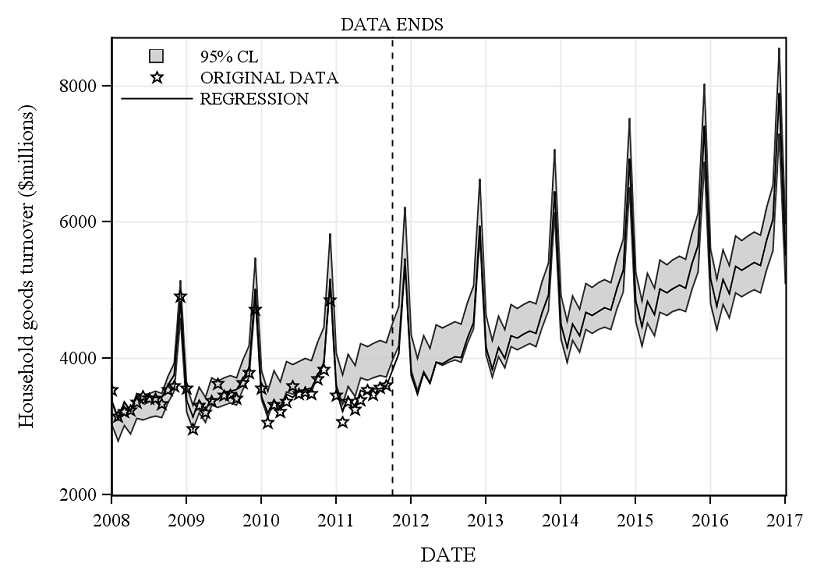

*Figure 18. Five Year Forecast, Date Restricted*

Figure 18 shows how the forecast of the autoregressive series resembles the regression forecast except with some adjustment by the autoregressive components of the model. For this new model, Root MSE=0.038, AIC=-1292.79 and SBC=-1230.89. These fit statistics are not as good as those produced by the original regression. However, the original regression residuals were not independent, which means that those original fit statistic were unreliable. The new autoregressive model has an almost perfect DW of 2.05 (T=354, K=16; DW<sub>U</sub>=1.914, DW<sub>L</sub>=1.736), meaning that the residuals are independent. Examination of normality plots (e.g. histogram, QQ plots) confirms that they are also normally distributed.

*AUTOREG Equation*

Household goods sales<sub>*t*</sub> = 6.87+.005(Month)-0.36(Jan)-0.45(Feb)-0.38(Mar)-0.43(Apr)-0.36(May)-0.37(Jun)-0.36(Jul)-0.36(Aug)-0.37(Sep)-0.31(Oct)-0.26(Nov)+*e*<sub>t</sub>

*e*<sub>t</sub>=0.27*e*<sub>(t-1)</sub>+0.24*e*<sub>(t-2)</sub>+0.37*e*<sub>(t-3)</sub>+*a*<sub>(t)</sub>

*a*<sub>t</sub>=White noise

This regression with AR errors model successfully captures the remaining pattern in the regression residuals. This corrects the main problem with the regression and can be used for long-term forecasts. It may also be used for short-term forecasts but will not be as accurate at the SARIMA in the short-term.

```sas
PROC AUTOREG DATA=REG_INPUT plot=wn;
	MODEL HG_RETAIL_LOG = month jan feb mar apr may jun jul aug sep oct nov / p=3 backstep MAXITER=1000 ;
	OUTPUT OUT=AUTOREGRESSION RESIDUAL=AUTREG_RES PREDICTED=AUTOREG_PRED LCLM=AUTOREG_LCLM UCLM=AUTOREG_UCLM;
RUN;
PROC SGPLOT DATA=AUTOREGRESSION;
	FOOTNOTE ITALIC JUSTIFY=LEFT "test plot: Full Series with Regression Forecast";
	WHERE DATE<='1JUL2012'd;
	REFLINE 0 / AXIS=y LINEATTRS=(COLOR=BLACK PATTERN=2);
	LOESS X=DATE Y=AUTREG_RES / MARKERATTRS=(COLOR=BLACK) LINEATTRS=(COLOR=BLACK) ALPHA=.05 CLM LEGENDLABEL="LOESS" NAME="LINE1";
	KEYLEGEND "LINE1" / NOBORDER LOCATION=INSIDE POSITION=BOTTOMRIGHT;
RUN; FOOTNOTE;
DATA AUTOREGRESSION2;
	MERGE AUTOREGRESSION REGRESSION;
RUN;
DATA A;
	SET ARIMA;
	FORECAST=EXP(FORECAST+STD*STD/2);
	L95=EXP(L95);
	U95=EXP(U95);
	KEEP FORECAST L95 U95 DATE;
RUN;
DATA B;
	SET REGRESSION;
	REG_PRED=EXP(REG_PRED+STDI*STDI/2);
	REG_LCL=EXP(REG_LCL);
	REG_UCL=EXP(REG_UCL);
	KEEP REG_PRED REG_LCL REG_UCL DATE;
RUN;
DATA C;
	SET AUTOREGRESSION2;
	AUTOREG_PRED=EXP(AUTOREG_PRED+STDI*STDI/2);
	AUTOREG_LCLM=EXP(AUTOREG_LCLM);
	AUTOREG_UCLM=EXP(AUTOREG_UCLM);
	KEEP AUTOREG_PRED AUTOREG_LCLM AUTOREG_UCLM DATE;
RUN;
DATA MASTER;
	MERGE A B C HOUSEHOLD;
	BY DATE;
RUN;
PROC SGPLOT DATA=MASTER;
	FOOTNOTE ITALIC JUSTIFY=LEFT "Figure 18: Five Year Forecast, Date Restricted";
	BAND UPPER=AUTOREG_UCLM LOWER=AUTOREG_LCLM X=DATE / OUTLINE FILL TRANSPARENCY=.2 LEGENDLABEL="95% CL";
	REFLINE "01oct2011"d / AXIS=X LABEL=("DATA ENDS") LINEATTRS=(COLOR=BLACK PATTERN=2) LABELLOC=OUTSIDE;
	SCATTER X=DATE Y=HG_RETAIL / LEGENDLABEL="ORIGINAL DATA" MARKERATTRS=(SYMBOL=STAR);
	SERIES X=DATE Y=AUTOREG_PRED / LEGENDLABEL="REGRESSION";
	XAXIS GRID OFFSETMIN=0 OFFSETMAX=0  MIN='1JUL2008'd MAX='1JUL2016'd;
	YAXIS GRID OFFSETMIN=0 MIN=2000;
	KEYLEGEND / NOBORDER DOWN=4 LOCATION=INSIDE POSITION=TOPLEFT;
RUN; FOOTNOTE;
```

For a final model comparison all three series of predicted values are plotted in Figure 11.

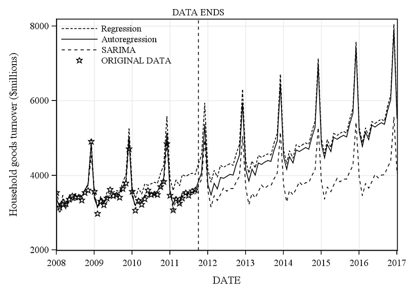

*Figure 19. Forecast Comparison*

As a composite model, the autoregression is between the normal regression and SARIMA forecasts. Although it is an improvement on the normal regression, for short-term forecasts the autoregression is less suitable than the SARIMA. The SARIMA was able to reduce the residuals almost entirely to white noise and produce better fit statistics. This may be because the optimised SARIMA fit used two moving average factors. If this is what the series requires for an optimal fit then the autoregression will not be able to compete, given that it is restricted to AR factors. For long-term forecasts, the confidence intervals of the SARIMA expand after a few years, making the autoregression a more reliable alternative within that time span.

#### Conclusion

If only a single model will be produce for several years of forecasting, including into the long-term, then the autoregression model will be the most reliable (i.e. a balance between short/long-term forecasting accuracy). However, if a new model will be produced each year and only forecasted short-term, the superior fitting SARIMA model is the most reliable.

```sas
PROC SGPLOT DATA=MASTER;
	FOOTNOTE ITALIC JUSTIFY=LEFT "Figure 19: Forecast Comparison";
	SERIES X=DATE Y=REG_PRED / LEGENDLABEL="Regression" lineattrs=(color=BLACK pattern=3);
	SERIES X=DATE Y=AUTOREG_PRED / LEGENDLABEL="Autoregression" lineattrs=(color=BLACK pattern=1) ;
	SERIES X=DATE Y=FORECAST / LEGENDLABEL="SARIMA" lineattrs=(color=black pattern=2);
	REFLINE "01oct2011"d / AXIS=X LABEL=("DATA ENDS") LINEATTRS=(COLOR=BLACK PATTERN=2) LABELLOC=OUTSIDE;
	SCATTER X=DATE Y=HG_RETAIL / LEGENDLABEL="ORIGINAL DATA" MARKERATTRS=(SYMBOL=STAR);
	YAXIS GRID OFFSETMIN=0 MIN=2000 LABEL="Household goods turnover ($millions)";
	XAXIS GRID OFFSETMIN=0 OFFSETMAX=0  MIN='1JUL2008'd MAX='1JUL2016'd;
	KEYLEGEND / NOBORDER DOWN=4 LOCATION=INSIDE POSITION=TOPLEFT;
RUN; FOOTNOTE;
ODS RTF CLOSE; ODS GRAPHICS OFF;
```

# Air Travel Departures & Arrivals

The plot below shows short-term depatures and arrivals.

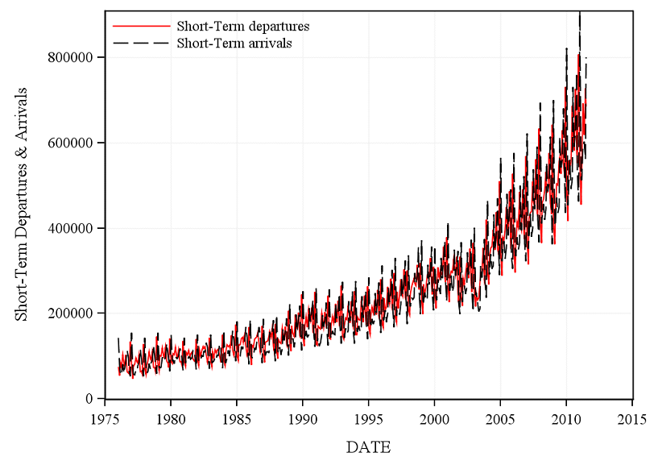

*Figure 20. Short-Term Departures and Arrivals*

These series should follow each other because they are connected; Anyone arriving for a short-term stay will necessarily become a short-term departure when they return home. There should be a lag between the two series because the same population is being measured in each series and departures/arrivals cannot occur simultaneously. This necessarily means that the two series will look similar and one will lag the other depending on the relationship. A date restricted sample of the series was plotted below to determine the lag.

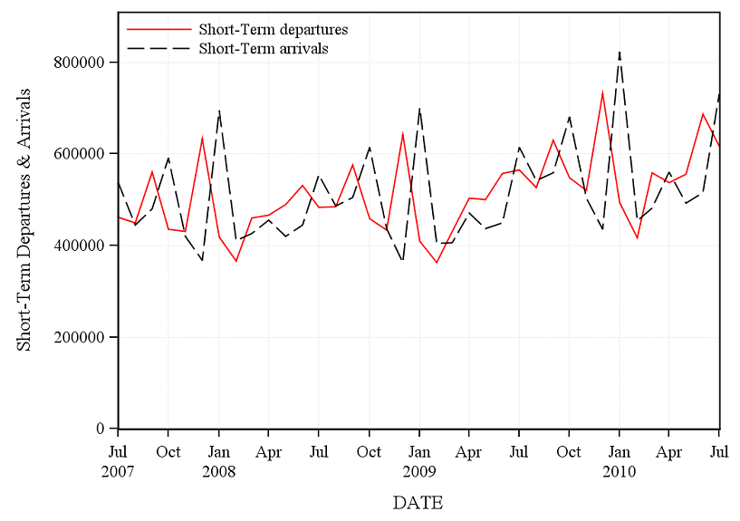

*Figure 21. STA/STD LAG*

In this series, STA lags STD, meaning that the STA pattern follows behind (i.e. is later than) STD. The likely behaviour observed is permanent residents departing on business or vacation and arriving home a short time later.

```sas
LIBNAME TSWORK 'C:\BasicSAS';
OPTIONS NOCENTER PAGESIZE=150 LINESIZE=256;
DATA NEW_ARRDEP;
	SET TSWORK.ARRDEP;
	DATE=INTNX('MONTH','1dec1975'd, _N_ );
	FORMAT DATE MMYYS.;
	LOG_STD=LOG(STD);
	LOG_STA=LOG(STA);
	RENAME STD=STD1; 
	LABEL LOG_STD="Log e of STD" LOG_STA="Log e of STA" STD1="Short-Term departures";
	DROP F7 LTA LTD PA PD;
RUN;

ODS GRAPHICS ON / RESET border=off HEIGHT=15CM;
ODS RTF FILE="MYFILE.rtf" STYLE=Styles.MYWAY1;

PROC SGPLOT DATA=NEW_ARRDEP;
	FOOTNOTE ITALIC JUSTIFY=LEFT "Figure 20: Short-Term Departures and Arrivals";
	SERIES X=DATE Y=STD1 / LINEATTRS=(COLOR=RED);
	SERIES X=DATE Y=STA / LINEATTRS=(COLOR=BLACK);
	XAXIS GRID OFFSETMIN=0 OFFSETMAX=0;
	YAXIS GRID OFFSETMIN=0 OFFSETMAX=0 LABEL="Short-Term Departures & Arrivals";
	KEYLEGEND / DOWN=2 NOBORDER LOCATION=INSIDE POSITION=TOPLEFT;
RUN; FOOTNOTE;
PROC SGPLOT DATA=NEW_ARRDEP;
	FOOTNOTE ITALIC JUSTIFY=LEFT "Figure 21: STA/STD LAG";
	SERIES X=DATE Y=STD / LINEATTRS=(COLOR=RED);
	SERIES X=DATE Y=STA / LINEATTRS=(COLOR=BLACK);
	XAXIS GRID OFFSETMIN=0 OFFSETMAX=0 MIN='1JUL2007'd MAX='1JUL12010'd;
	YAXIS GRID OFFSETMIN=0 OFFSETMAX=0 LABEL="Short-Term Departures & Arrivals";
	KEYLEGEND / DOWN=2 NOBORDER LOCATION=INSIDE POSITION=TOPLEFT;
RUN; FOOTNOTE;
```

These series must be transformed to make them stationary in the variance. This is necessary before most forecasting techniques are appropriate. The scales of both series were transformed with a natural logarithm. This is because a log scale was only appropriate for STD, not STA. If STD is to be compared to STA then both must undergo the same transformation.

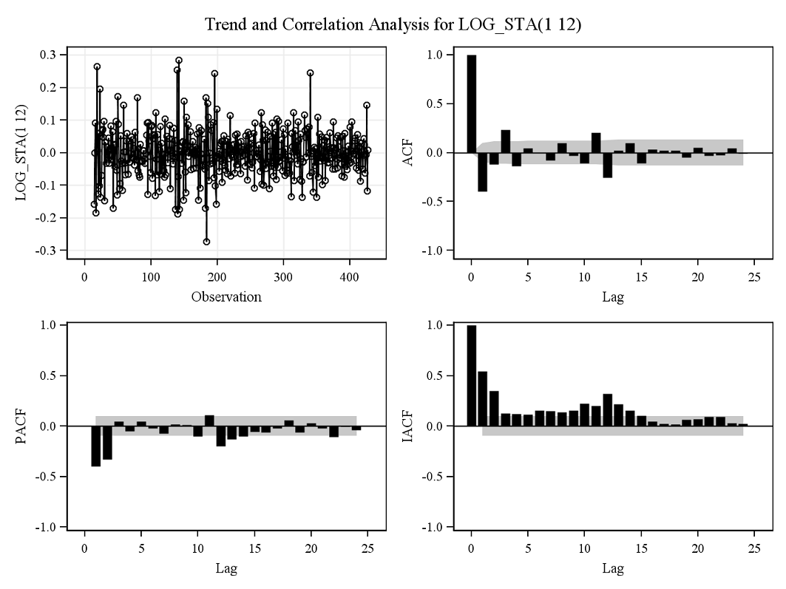

*Figure 22. Identification graphs for SARIMA modelling*

The identification panel in Figure 22 shows that the series is stationary after a first and seasonal difference. There are two significant peaks on the PACF, and 1 significant peak on the ACF. According to the identification table this means the starting model is ARMA(1,1), meaning p=1 and q=1.

This model was optimised to provide the best fit statistics and the final model was a SARIMA(2,1,0)(0,1,1)<sub>12</sub>, functional code p=(1,2) Q=(12). This produced a parsimonious model with AIC=-1150.36, SBC=-1138.28 and Standard Error=0.06.

The model residuals where independent, homoscedastic and normally distributed. There was only one significant (*p*<.05) white noise correlation test (lag 36) and DW was 1.988, which is very close to 2 and shows no significant residual autocorrelation (T=414, K=4; DW<sub>U</sub>=1.859, DW<sub>L</sub>=1.832).

*Conditional Least Squares Estimation*

|Parameter|Estimate|Standard Error|*t* Value|Approx Pr > \|*t*\||Lag|
|:--|--|--|--|--|--|
|MA1,1|0.33377|0.04746|7.03|<.0001|12|
|AR1,1|-0.51679|0.04635|-11.15|<.0001|1|
|AR1,2|-0.36083|0.04630|-7.79|<.0001|2|

*Table 7. SARIMA Autoregressive and Moving Average terms*

The above table shows the terms used in the final SARIMA model. The constant was not significant and was removed. This selection of terms produced the best model with the lowest number of terms.

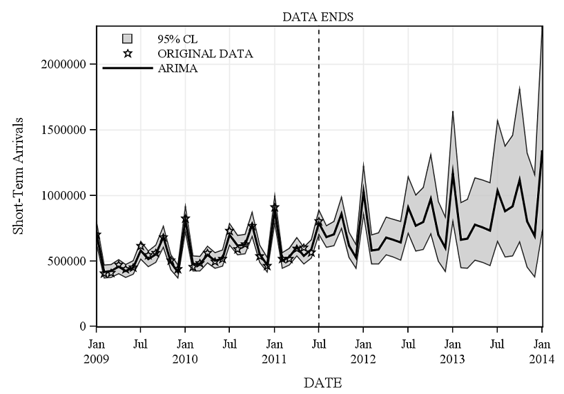

*Figure 23. Three Year Forecast of Short-Term Arrivals*

Figure 23 shows a three year forecast of STA. Note that the confidence limits expand with each successive year, as is typical of ARIMA modelling.

*Equation*

(1-*B*)(1-*B*<sup>12</sup>)(1-.52*B*-.36*B*<sup>2</sup>)STD<sub>*t*</sub>=(1-.33*B*<sup>12</sup>)*e*<sub>*t*</sub>

```sas
PROC ARIMA DATA=NEW_ARRDEP PLOTS(ONLY)=(SERIES(CORR) RESIDUAL(CORR NORMAL SMOOTH) FORECAST(ALL));
	IDENTIFY VAR=LOG_STA(1,12) NLAG=24 CLEAR;
	ESTIMATE p=(1,2) Q=(12) NOCONSTANT;
	FORECAST ID=DATE INTERVAL=MONTH PRINTALL LEAD=36 OUT=ARIMA;
RUN; QUIT;
PROC REG DATA=ARIMA;
	MODEL RESIDUAL= /DW;
RUN;
DATA ARIMASTA;
	MERGE NEW_ARRDEP ARIMA;
	BY DATE;
	FORECAST=EXP(FORECAST+STD*STD/2);
	L95=EXP(L95);
	U95=EXP(U95);
	DROP STD RESIDUAL MOY LOG_STD;
RUN;
PROC SGPLOT DATA=ARIMASTA;
	FOOTNOTE ITALIC JUSTIFY=LEFT "Figure 23: Three Year Forecast of Short-Term Arrivals";
	REFLINE "01JUL2011"d / AXIS=X LABEL=("DATA ENDS") LINEATTRS=(COLOR=BLACK PATTERN=2) LABELLOC=OUTSIDE;
	BAND UPPER=U95 LOWER=L95 X=DATE / FILL OUTLINE TRANSPARENCY=.2 LEGENDLABEL="95% CL";
	SCATTER X=DATE Y=STA / LEGENDLABEL="ORIGINAL DATA" MARKERATTRS=(SYMBOL=STAR);
	SERIES X=DATE Y=FORECAST / LEGENDLABEL="ARIMA" LINEATTRS=(COLOR=BLACK thickness=2);
	XAXIS GRID OFFSETMIN=0 OFFSETMAX=0 MIN='1jan2009'd MAX='1jan2014'd;
	YAXIS GRID OFFSETMIN=0 OFFSETMAX=0 LABEL="Short-Term Arrivals";
	KEYLEGEND / DOWN=3 NOBORDER LOCATION=INSIDE POSITION=TOPLEFT;
RUN; FOOTNOTE;
```

PROC AUTOREG was used to model STA with STD. The autoregression model included the original STD variable and four STD lag variables (lag1,2,3,4). STD-Lag 3 was not significant (*p*<.05) and was removed from the regression. The final model is shows in Table 9.

*Parameter Estimates*

|Variable|DF|Estimate|Standard Error|*t* Value|Approx Pr > \|*t*\||Variable Label|
|:--|--|--|--|--|--|--|
Intercept|1|-0.2116|0.1127|-1.88|0.0611||
|LOG_STD|1|-0.3396|0.0297|-11.44|<.0001|Log e of STD|
|LOG_STDlag1|1|1.0049|0.0283|35.55|<.0001||
|LOG_STDlag3|1|0.2937|0.0282|10.41|<.0001||
|LOG_STDlag4|1|0.0572|0.0296|1.93|0.0541||

*Table 8. Regresion Parameters*

The final autoregressive terms are tabled below.

*Estimates of Autoregressive Parameters*

|Lag|Coefficient|Standard Error|*t* Value|
|--:|--|--|--|
|1|0.140770|0.033338|4.22|
|4|0.079011|0.032766|2.41|
|12|-0.711080|0.033020|-21.53|

*Table 9. Autoregressive parameters*

As shown in Table 9, the lag terms were 1, 4 and 12. Autoregressive terms started at p=12 and the BACKSTEP selection process was used to identify the most effective AR terms. It selected 1, 4, 7 and 12. Lags 1 and 12 are the main non-seasonal and seasonal factors typical in monthly time series. Lag 4 could be theorised as a cycle of flights that repeats three times each year. Lag 7 is unexplainable and was removed from the AR factors, leaving 1, 4 and 12. This produced a parsimonious model with AIC=-1168.38, SBC=-1136.00 and Root MSE=0.06.

The DW was 2.02 which was close enough to 2 to show no significant residual autocorrelation at lag one (T=418, K=8; DW<sub>U</sub>=1.874, DW<sub>L</sub>=1.806). Despite the good DW, which checks autocorrelation at lag 1, from lag 18 onwards all the autocorrelation checks are borderline significant (*p*<.05). The R<sup>2</sup> was 0.969 and increased to 0.991, meaning that the dynamic model accounted for 99% of the variability in STA.

*AUTOREG Equation*

STA<sub>*t*</sub>=-0.212-0.44STD<sub>(t)</sub>+1.004STD<sub>(t-1)</sub>+0.294STD<sub>(t-3)</sub>+0.057STD<sub>(t-4)</sub>+*e*<sub>t</sub>

*e*<sub>t</sub>=0.141*e*<sub>(t-1)</sub>+0.079*e*<sub>(t-4)</sub>+0.711*e*<sub>(t-12)</sub>+*a*<sub>(t)</sub>

*a*<sub>(t)</sub>=White noise

In some cases, the predictor variable comes before the forecast variable, meaning that next year's forecast can be carried out with real current data. However, if the predictor variable happens after the forecast variable then it is necessary to forecast the predictor variable first and then use those forecasts as predictors in the dynamic model.

In order to forecast with this specific dynamic model the above SARIMA was used to produce a forecast for STD. This was then log transformed and lagged at 1, 3 and 4 in accord with the dynamic model's needs. This forecasted data was plot three years ahead below.

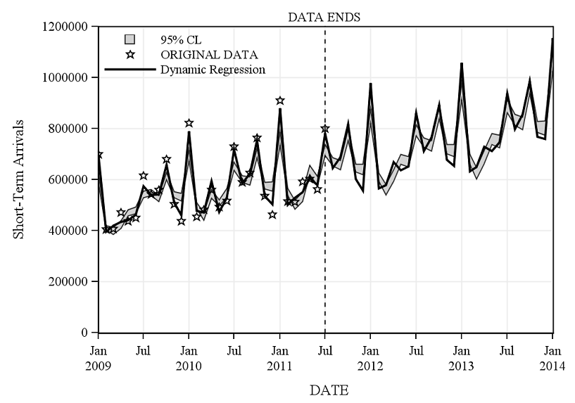

*Figure 24. Three Year Forecast of Short-Term Arrivals*

In comparing the plots of the two models above, Figures 23 and 24, the SARIMA model tracks the most recent data points almost perfectly and continues the pattern of the most recent data in the forecast. This becomes less accurate for long-term forecasts. In contrast, the dynamic regression model does not follow the most recent data points as well, yet replicates the series pattern and maintains confidence into long-term forecasting.

#### Conclusion

Several statistics were compared to determine the best model. The Root MSE (i.e. Standard Error for SARIMA) are identical to two decimal places for both models, meaning neither model controls error better at any meaningful magnitude. Similarly, the AIC for the dynamic regression model is only 18 points better than the SARIMA, and the SARIMA has an SBC only 2 points better than the dynamic regression model. The DW statistics are also almost indistinguishable, with the SARIMA scoring 1.988 and the Dynamic Regression scoring 2.02, both of which show no significant autocorrelation lag 1.

SARIMA is obviously unreliable for long-term forecasts, especially when compared to regression models that are better suited for forecasting long-term. However, despite the similar fit statistics, there are three reasons why the SARIMA model is better for short-term forecasts. Firstly, the SARIMA model better controls autocorrelation of residuals above lag 1, which is not measured by DW. Secondly, the SARIMA is more parsimonious, producing a model of equal quality with only 3 coefficients rather than 7. Finally, the SARIMA responds more quickly to recent shifts in the series, while the regression incorporates more of the overall trend in forecasts, meaning that for short-term forecasts the SARIMA will be more accurate.

```sas
DATA NEW2_ARRDEP;
	set TSWORK.ARRDEP;
	BY DATE;
	DATE=INTNX('MONTH','1dec1975'd, _N_ );
	FORMAT DATE MMYYS.;
	LOG_STD=LOG(STD);
	LOG_STA=LOG(STA);
	LOG_STDlag1=lag1(LOG_STD);
	LOG_STDlag2=lag2(LOG_STD);
	LOG_STDlag3=lag3(LOG_STD);
	LOG_STDlag4=lag4(LOG_STD);
	LABEL LOG_STD="Log e of STD" LOG_STA="Log e of STA";
	DROP F7 LTA LTD PA PD;
RUN;
PROC AUTOREG DATA=NEW2_ARRDEP;
	MODEL LOG_STA = LOG_STD LOG_STDlag1 LOG_STDlag3 LOG_STDlag4 / NLAG=(1 4 12) MAXITER=1000;
	OUTPUT OUT=AUTOREGRESSION RESIDUAL=AUTREG_RES PREDICTED=AUTOREG_PRED LCLM=AUTOREG_LCLM UCLM=AUTOREG_UCLM;
RUN;

*Autoreg Forecasting;
DATA ARSET_ARRDEP;
	SET TSWORK.ARRDEP;
	DATE=INTNX('MONTH','1dec1975'd, _N_ );
	FORMAT DATE MMYYS.;
	LOG_STD=LOG(STD);
	LABEL LOG_STD="Log e of STD" ;
	DROP F7 LTA LTD PA PD STA moy apr aug dec feb jan jul jun mar may nov oct sep;
RUN;
PROC ARIMA DATA=ARSET_ARRDEP PLOTS(ONLY)=(SERIES(CORR) RESIDUAL(CORR NORMAL SMOOTH) FORECAST(ALL));
	IDENTIFY VAR=LOG_STD(1,12) NLAG=48 CLEAR;
	ESTIMATE p=(3) Q=(1)(12) NOCONSTANT;
	FORECAST ID=DATE INTERVAL=MONTH PRINTALL LEAD=36 OUT=ARIMA_STD;
RUN; QUIT;
DATA ARIMA_STD;
	SET ARIMA_STD;
	FORECAST=EXP(FORECAST+STD*STD/2);
	IF _N_<=427 THEN DELETE;
	DROP STD L95 U95 RESIDUAL LOG_STD;
	RENAME FORECAST=STD;
RUN;
DATA ARIMA_STD;
	SET ARIMA_STD;
	STD=ROUND(STD,1);
	LABEL STD="Short-Term departures";
RUN;
DATA AUTOREG_F0;
 SET TSWORK.ARRDEP;
  DATE=INTNX('MONTH','1dec1975'd, _N_ );
  FORMAT DATE MMYYS.;
  DROP F7 LTA LTD PA PD month moy apr aug dec feb jan jul jun mar may nov oct sep;
RUN;
DATA AUTOREG_F1;
	SET AUTOREG_F0 ARIMA_STD;
	LOG_STA=LOG(STA);
	LOG_STD=LOG(STD);
	LOG_STDlag1=lag1(LOG_STD);
	LOG_STDlag3=lag3(LOG_STD);
	LOG_STDlag4=lag4(LOG_STD);
RUN;
PROC AUTOREG DATA=AUTOREG_F1;
	MODEL LOG_STA = LOG_STD LOG_STDlag1 LOG_STDlag3 LOG_STDlag4 / NLAG=(1 4 12) MAXITER=1000;
	OUTPUT OUT=AUTOREGRESSION RESIDUAL=AUTREG_RES PREDICTED=AUTOREG_PRED LCLM=AUTOREG_LCLM UCLM=AUTOREG_UCLM;
RUN; QUIT; RUN;
DATA AUTOREG_FORECAST;
	SET AUTOREGRESSION;
	AUTOREG_PRED=EXP(AUTOREG_PRED);
	AUTOREG_LCLM=EXP(AUTOREG_LCLM);
	AUTOREG_UCLM=EXP(AUTOREG_UCLM);
	DROP STD RESIDUAL MOY LOG_STD LOG_STDlag1 LOG_STDlag2 LOG_STDlag3 LOG_STDlag4;
RUN;
PROC SGPLOT DATA=AUTOREG_FORECAST;
	FOOTNOTE ITALIC JUSTIFY=LEFT "Figure 24: Three Year Forecast of Short-Term Arrivals";
	REFLINE "01JUL2011"d / AXIS=X LABEL=("DATA ENDS") LINEATTRS=(COLOR=BLACK PATTERN=2) LABELLOC=OUTSIDE;
	BAND UPPER=AUTOREG_UCLM LOWER=AUTOREG_LCLM X=DATE / FILL OUTLINE TRANSPARENCY=.2 LEGENDLABEL="95% CL";
	SCATTER X=DATE Y=STA / LEGENDLABEL="ORIGINAL DATA" MARKERATTRS=(SYMBOL=STAR);
	SERIES X=DATE Y=AUTOREG_PRED / LEGENDLABEL="Dynamic Regression" LINEATTRS=(COLOR=BLACK thickness=2);
	XAXIS GRID OFFSETMIN=0 OFFSETMAX=0 MIN='1jan2009'd MAX='1jan2014'd;
	YAXIS GRID OFFSETMIN=0 OFFSETMAX=0 LABEL="Short-Term Arrivals";
	KEYLEGEND / DOWN=3 NOBORDER LOCATION=INSIDE POSITION=TOPLEFT;
RUN; FOOTNOTE;
```

