*Forecasting Basics*
====================

Early time-series analysis relied on index numbers, trend decomposition and complex smoothing methods. These systems are still in use today and form the basis of modern autoregressive methods.

Index Numbers
=============

A real life index number is the Wage Price Index (WPI). It measures the relative change in hourly wages paid by Australian employers to employees over time (i.e. between a base year and current year). The WPI is an aggregate price index that involves combing into a single specified average the total hourly wages of a standardised and representative set of vocations in a base or reference period. This is then recalculated at future periods and compared to the base period. This produces a statistic of percentage change in wages that isn't affected by labour force characteristics, hours worked or performance.

Indexes, especially aggregate indexes, are important because they streamline percentage change comparisons across time for a wide range of areas. The WPI is important because it represents a concise, easily reported and understood measure of 'change in wages', including direction and magnitude. Moreover, deeper investigation into its aggregate components allows comparisons between sectors (e.g. public vs. private) and industries (e.g. mining, manufacturing, etc.). Such comparisons would otherwise be impractical or impossible through direct measurement.

Common Formula
--------------

*Data Set*

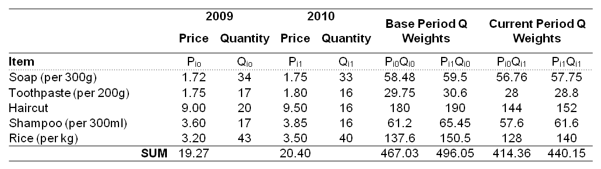

*Simple Aggregate Price Index*

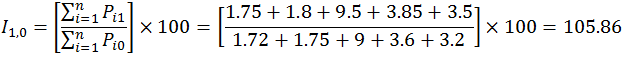

*Laspeyres Price Index*

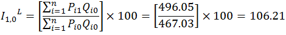

*Paasche Price Index*

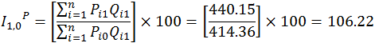

*Fisher Price Index*

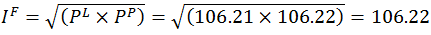

Comparison
----------

The information conveyed by the Simple Aggregate Price Index is that the one year increase (2008 to 2009) in the total personal items prices is 5.86% (105.86-100) in Australia during 2008 to 2009. The Laspeyres Price Index showed that when prices are weighted by 2008 sale quantities, there was a 6.21% increase in prices between 2008 and 2009. The Paasche Price Index showed that when prices are weighted by 2009 sale qualities, prices increased by 6.22% over the same time period. The Fisher Price Index showed that when both weighted indexes are combined (i.e. their geometric mean), the price of the five personal items increased by 6.22% between 2008 and 2009.

Of the two methods (i.e. aggregate vs. weighted), the weighted methods are a better measure of change. This is because the weighting by quantity adjusts for differences in sales between the periods. The Fisher Index, which combines weighting from multiple periods, is the best of the three weighted methods, as it provides a single answer (rather than two) and includes weighting from both time periods.

Historical Trend Analysis
=========================

Consider the following time series.

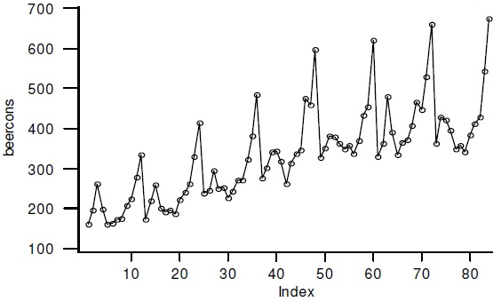

*Figure 1.* Monthly Beer Consumption

These data have an increasing trend over the course of the time series. This is clear and linear for most of the data but it flattens towards the end. The increasing trend stops the mean from being constant, and the magnitude of seasonal fluctuations around the trend increases, so the series cannot be considered horizontal. There's a seasonal component, as the series has a period 12 pattern of peaks and troughs. There are no other clear patterns within the series outside this fixed period, suggesting these data lack any clear cyclic component. The irregular component will be present but small, due to the negligible random variation from the seasonal pattern and the changes in seasonal fluctuations being smooth and not erratic.

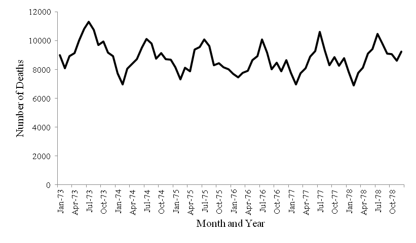

*Figure 2.* Accidental Deaths in the US

The pattern is horizontal because the data values fluctuate around a constant mean. Because the magnitudes of these fluctuations are stable across the series, the pattern is also stationary. There's a period 12 seasonal component (i.e. every 12 observations, every 12 months in real time), with troughs every February, peaks every July. The seasonal component is clear enough for a small secondary peak to present seasonally each October. The series lacks a cyclical component, as the variation within the series appears to be restricted to seasonal period 12 patterns with no apparent cyclical variation outside this fixed period. Similarly, there is no long-term increase or decrease in the data, so this series also lacks a trend component. The pattern contains a small irregular component, with minor variation in the peak/trough pattern and throughout the series.

Smoothing and Decomposition
---------------------------

Consider the following time series of quarterly earnings (in millions of dollars) of a large *faux* retail company, "Buymore".

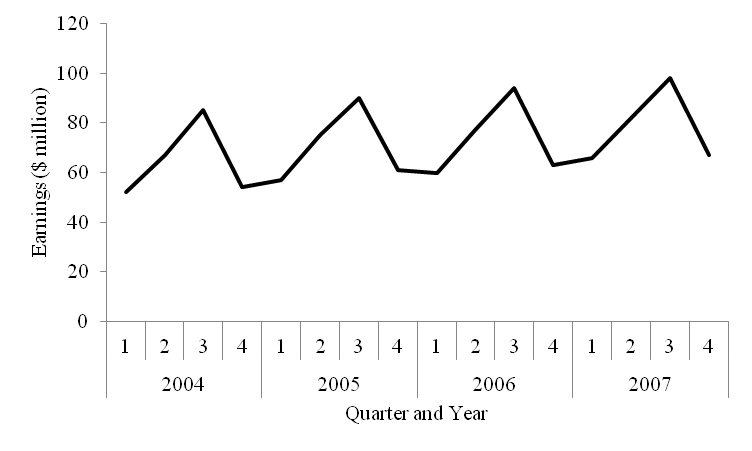

*Figure 3.* Quarterly "Buymore" Earnings

Despite the slight trend, these data mostly fluctuate around a constant mean and the magnitude of fluctuations around the mean are stable across the series. It is therefore stationary and horizontal.

The data is quarterly with a fixed pattern of period four (i.e. every four quarters), the repeating annual pattern of peaks of troughs demonstrating a seasonal component. No larger cyclical patterns are evident outside this fixed period. As noted above, there is a very small increasing trend. The series is smooth and clean, giving it a small irregular component.

This time series should be deseasonalised (i.e. seasonally adjusted) to remove the influence of seasonal patterns in the time series. Removing the seasonal component from a series makes the remaining components more visible (e.g. trend, irregular and cyclical). The absence of seasonal variation makes it simpler to identify and analyse other components, especially long-term trends.

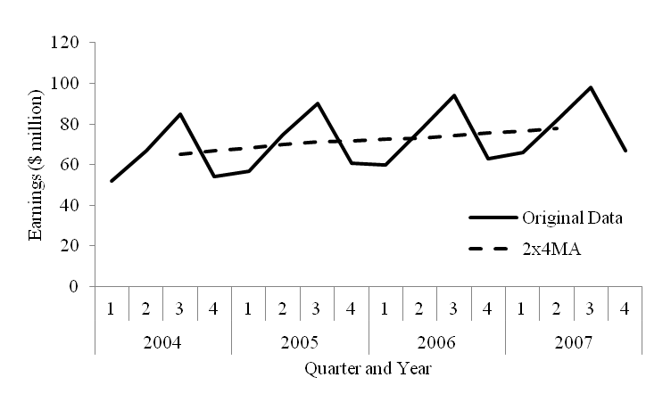

*Figure 4.* Centred Moving Average (four-quarter)

With the seasonal component smoothed, conclusions about the trend are easier to make, that is, that there is a small increasing trend across the time series.

A 2x4 MA smoother length was used for two reasons. Firstly, the even number of periods within each fixed seasonal pattern, and even number of overall data points, make some other moving averages (e.g. 3MA, 5MA, etc.) inappropriate. Secondly, 2x4 MA is effectively a weighted moving average of period five, capable of placing equal weights on each quarter while simultaneously including data periods from consecutive years, which further smooths and averages out seasonality.

Table 1. *Quarterly Seasonal Indices (Classical Multiplicative Decomposition)*

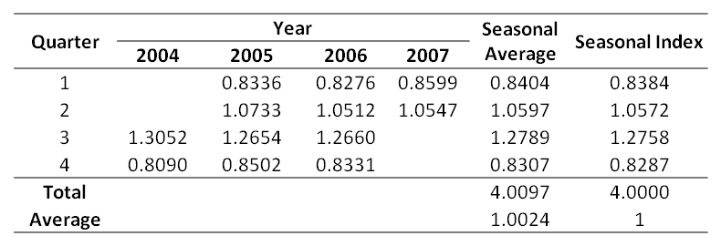

The seasonal indices indicate that on average "Buymore" earnings are:

-   16.16% (1-0.8384) below the annual average in the 1st quarter,
-   5.72% above the annual average in the 2nd quarter,
-   27.58% above the annual average in the 3rd quarter, and
-   17.13% (1-0.8287) below the annual average 4th quarter.

Moving averages can be used to deseasonalise the series and emphasise any stable trends.

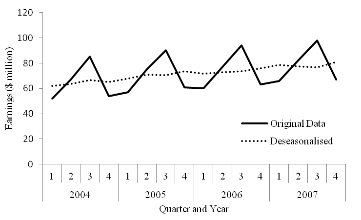

*Figure 5.* Deseasonalised Time Series

The deseasonalised series support the previous graphical interpretation, which is that this series is mostly horizontal and stationery, with a very small increasing trend (i.e. growth).

Exponential Smoothing
=====================

The following time series is Canadian unemployment rate data as a percentage of the civilian labour force. It is seasonally adjusted and includes 1974 to the third quarter of 1975. The 4th quarter can be estimated using single exponential smoothing, tested at both *a*=0.5 and *a*=0.8.

Table 2. *Exponential Smoothing*

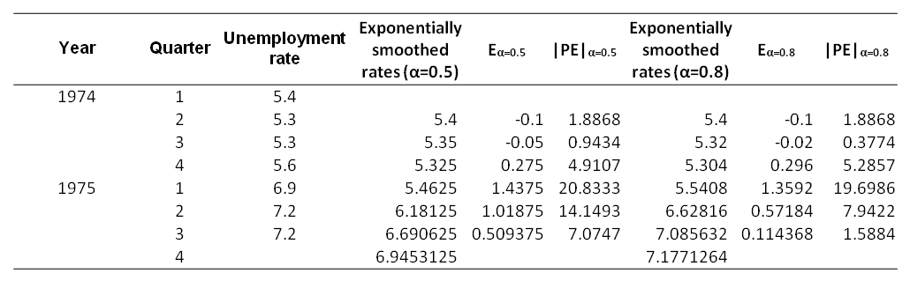

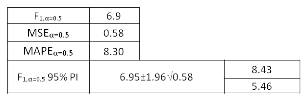

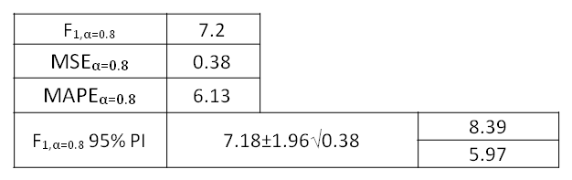

The exponential smoothing and forecast with an *alpha* level of 0.8 has a lower MSE, MAPE and a narrower 95% prediction interval than smoothing with an *alpha* level of 0.5. Based on these results an *alpha* level of 0.8 provides a better forecast.

A general guideline for selecting the best *alpha* level when using historical data is to choose the one with the least error. That is, the *alpha* level that has the lowest MSE and MAPE, and ideally comparing a range of other measures (e.g. Theil's U, prediction intervals, time series graphs of smoothed data, etc.). To calculate this manually, the analyst would try several *alpha* levels and choose the best one on the above measures. However, computer programs (e.g. Excel Solver) can optimize this value automatically, producing an *alpha* level that produces the best forecast, the least error and optimal smoothing (i.e. smooth, with other components still visible and not over-fit).

Holt-Winter's Smoothing
=======================

Consider the following time series of retail turnover (in millions of dollars) for all Australian industries from 2001 to 2006 (Australian Bureau of Statistics).

Table 3. *Retail Turnover (dollar millions)*

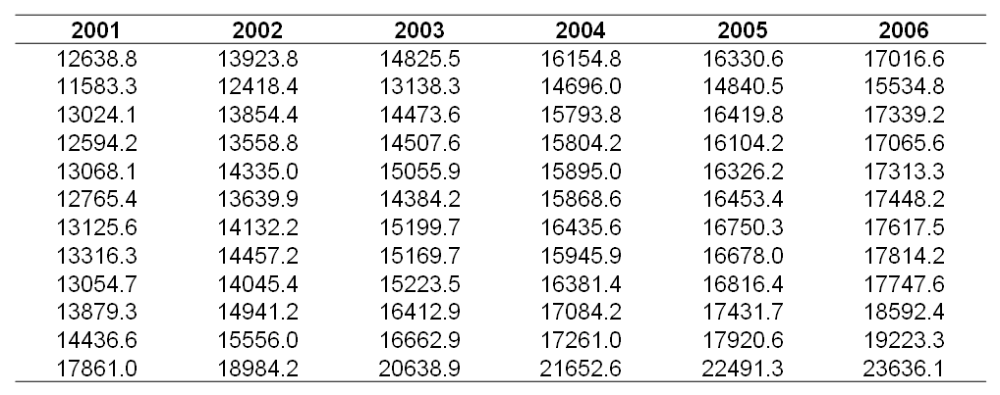

The data structure was modified for plotting and to apply a Holt-Winter's prediction model.

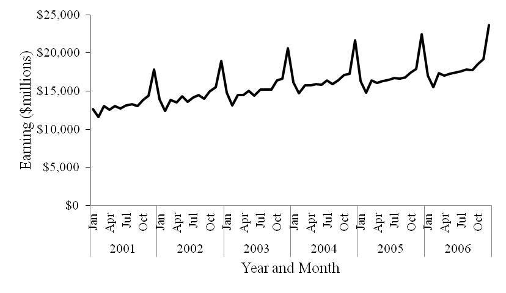

*Figure 6.* Retail Turnover (dollar millions)

There is a clear period 12 seasonal pattern in this monthly data (i.e. yearly seasonal component). There is also an increasing trend over the course of the time series. The error component will be small because the patterns are very clear and repeat in a stable fashion throughout the series. There is no obvious cyclical component.

The size of the peaks and troughs increase from the first year through to the last. This would suggest that the time series is multiplicative as is common with economic data. The only other variation across the time series is that there is some smoothing out of the March to September period. That period has greater irregularity as the start of the series than at the end. The pattern is relatively stable otherwise.

An autocorrelation function (ACF) was calculated. This was produced manually first, then confirmed with the SPSS autocorrelations procedure.

Table 4. *Autocorrelation Function Calculations*

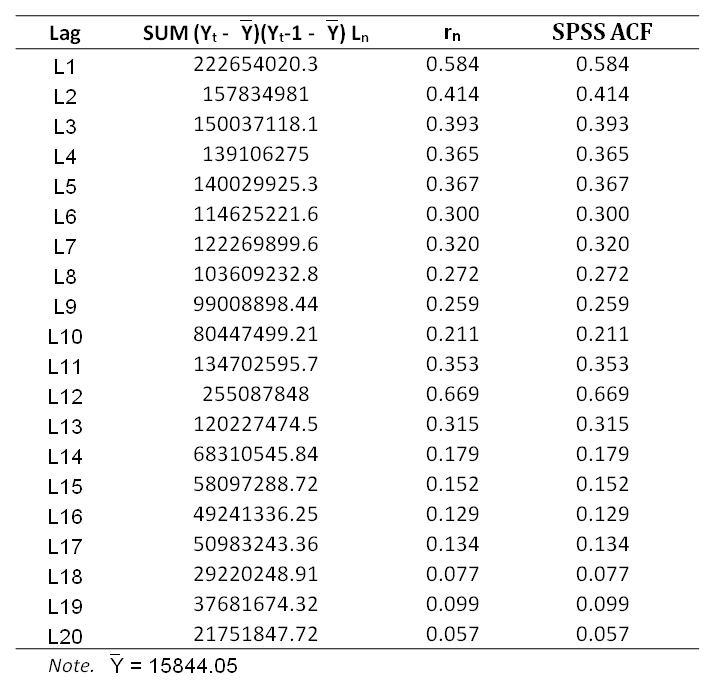

The ACF correlogram is more informative when plot.

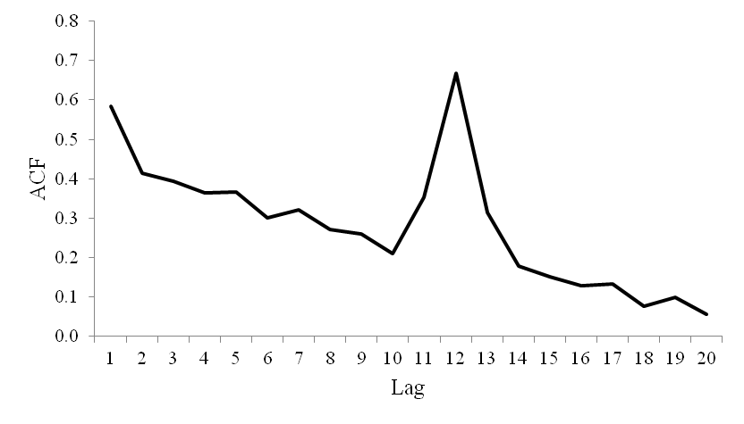

*Figure 7.* Correlogram Lag Plot

The autocorrelation peaks at lag 12 and is coming down from a peak at lag 1 and 13. This can be explained by the seasonal pattern in the data, which peaks every 12 months, then troughs, then leads up to another annual peak. The ACF stays above 0 for the 20 lag period calculated, reflecting the increasing linear trend in the data.

The ACF is similar to the initial line graph of the data. It vividly shows one seasonal peak and trough pattern that presents each year of the original time series.

Holt's Linear Method was applied to the retail turnover data. All available data were used in error calculation, starting at *t*2 and ending at *t*72. Excel solver optimised the *alpha* and *beta* to minimise the MSE. Results are below, including a table of the last year before the forecast and the forecasted year. See the appendix for calculation details.

An initial survey of the high MSE suggests that this model is not a good fit. However, further analysis and comparison with other models is required before a determination can be made.

Holt-Winter's Multiplicative Method was applied to the retail turnover data. All available data were used in error calculation, starting at *t*13 and ending at *t*72. Excel solver optimised the *alpha*, *beta* and *gamma* to minimise the MSE. Results are below, including a table of the last year before the forecast and the forecasted year.

Holt-Winter's method is more suitable in terms of finding the optimal smoothing constant than Holt's Linear Method. It is similar to Holt's Linear Method in that it allows for trends in the data. This is important, because the retail turnover data gradually increases over the course of the series. However, in addition to trends, the third exponential of the Holt-Winter's method allows for seasonal patterns. This makes is more suitable for series such as the retail turnover series that include not only a trend but also a seasonal pattern. Moreover, the Holt-Winter's multiplicative model better forecasts series where the variability of the data changes over the course of the data, which is common with economic data sets such as the retail turnover series.

The model produced by the Holt-Winter's multiplicative method can deal with time series that include trends, seasonality and multiplicative components. It should therefore produce models with less error and better forecasts for time series with these components, as compared to Holt's Linear Method.

Determining which method is superior for this series requires the production of some basic diagnostic statistics to determine how well the models fit. MSE, MAPE and Theil's U statistics were calculated and are presented below for comparison.

Table 5. *Holt Method Comparison*

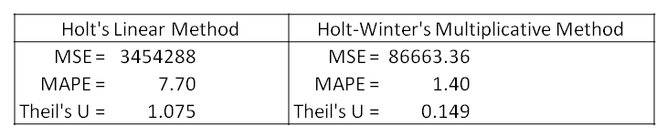

Holt-Winter's Multiplicative Method is clearly superior to Holt's Linear Method, producing less error as determined by absolute measures (MSE) and relative measures (MAPE).

Theil's U statistic, which has both absolute and relative components, is a useful figure for comparing models. In this example, The Holt's Linear Method scored 1.075, meaning that the model it produced is no better than a naive method (i.e. Ft+1=Yt). In contrast, the Holt-Winter's Multiplicative Method scored a Theil's U statistics of 0.149, meaning that it produced a model significantly better than the naive method.

The two forecasting methods were plotted below with the original data to visually demonstrate what these figures mean for the series and the forecasts.

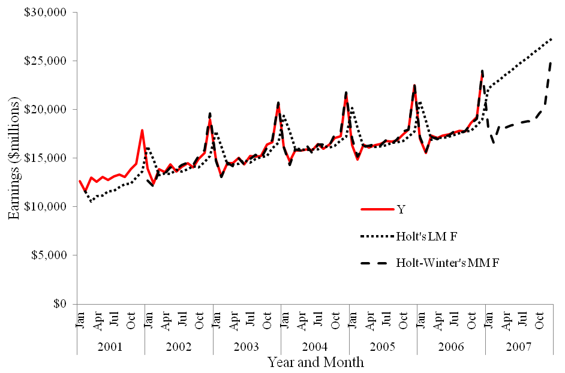

*Figure 8.* Retail Turnover Forecast Comparison

Observe that the Holt-Winter's Multiplicative Method follows the seasonal pattern throughout the series and then forecasts a similar seasonal pattern for 2007. Contrast this to the Holt's Linear Method. Although it follows the trend correctly during the series, it trails slightly behind it, smooths it, and loses all seasonality for the 2007 forecast. It does not appropriately capture the seasonal pattern. This is even clearer in a residual plot, shown below.

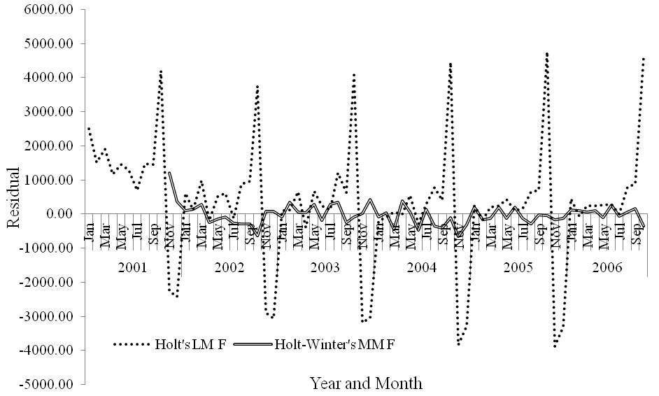

*Figure 9.* Residual Line Plot

When plot as a line graph, the residuals (errors) produced by Holt's Linear Method have a seasonal pattern. This reflects how that method is unable to appropriately capture this information from the time series and integrate it into the model. The Holt-Winter's residuals, however, look random and seem to lack any seasonal pattern, reflecting how the seasonal information was captured and used to improve the model, rather than being lost as error.

Therefore, for this time series, the greatest confidence should be given to Holt-Winter's Multiplicative Method.

Appendix. Calculations
======================

**Deseasonalising**

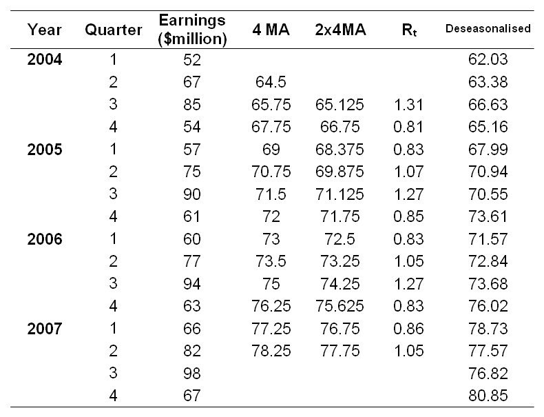

**Holt Winter's**

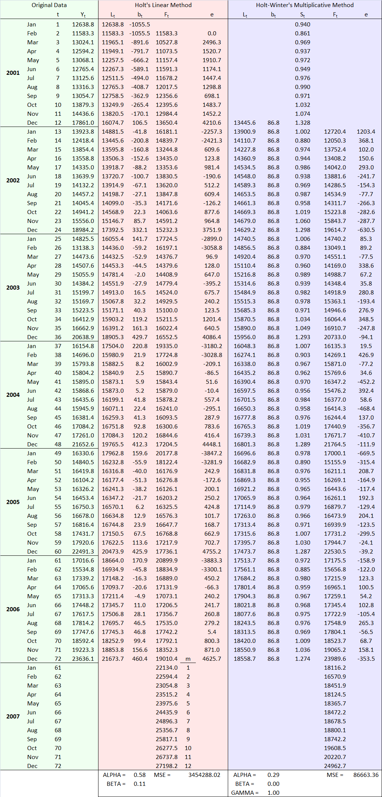
